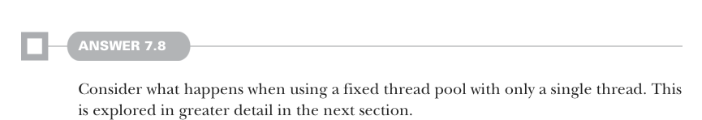
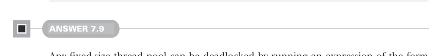

# Page 0205

[<- Page 0204](./page-0204) | [Pages index](./) | [Page 0206 ->](./page-0206)

> Part 2: Functional design and combinator libraries / Chapter 7: Purely functional parallelism / 7.6 Exercise answers



#### ANSWER 7.8

Consider what happens when using a fixed thread pool with only a single thread. This is explored in greater detail in the next section.



#### ANSWER 7.9

Any fixed-size thread pool can be deadlocked by running an expression of the form `fork(fork(fork(x)))`, where there’s at least one more `fork` than there are threads in the pool. Each thread in the pool blocks on the call to `.get`, resulting in all threads being blocked, while one more logical thread is waiting to run and, hence, resolve all the waiting.


#### ANSWER 7.10

We’ll return to this in chapter 13.

#### ANSWER 7.11

We compute the index of the `choice` by running `n` and awaiting the result. We then look up the `Par` in the `choices` at that index and run it:

```scala
def choiceN[A](n: Par[Int])(choices: List[Par[A]]): Par[A] =
es =>
val index = n.run(es).get % choices.size
choices(index).run(es)
```

Implementing `choice` in terms of `choiceN` involves converting the conditional to an index, which we can do via `map`. Here we’ve chosen to make the `true` case index `0` and the `false` case index `1`:

```scala
def choice[A](cond: Par[Boolean])(t: Par[A], f: Par[A]): Par[A] =
choiceN(cond.map(b => if b then 0 else 1))(List(t, f))
```

[<- Page 0204](./page-0204) | [Pages index](./) | [Page 0206 ->](./page-0206)
