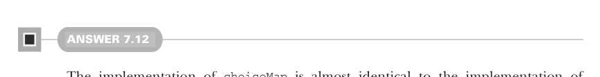

# Page 0206

[<- Page 0205](./page-0205) | [Pages index](./) | [Page 0207 ->](./page-0207)

> Part 2: Functional design and combinator libraries / Chapter 7: Purely functional parallelism / 7.6 Exercise answers

## 177 7.6 Exercise answers



#### ANSWER 7.12

The implementation of `choiceMap` is almost identical to the implementation of `choiceN`; instead of looking up a `Par` in a `List` using an index, we’re doing the lookup in a `Map` using a key:

```scala
def choiceMap[K, V](key: Par[K])(choices: Map[K, Par[V]]): Par[V] =
es =>
val k = key.run(es).get
choices(k).run
```

If you want, stop reading here, and see if you can come up with a new and more general combinator in terms of which you can implement `choice`, `choiceN`, and `choiceMap`.


#### ANSWER 7.13

The implementation is almost identical to both `choiceN` and `choiceMap`, with the only difference being how the `choice` lookup is done:

```scala
extension [A](pa: Par[A]) def chooser[B](choices: A => Par[B]): Par[B] =
es =>
val a = pa.run(es).get
choices(a).run
```

`choice` can now be implemented via `chooser` by passing a function that selects `t` when `cond` returns a `true` and `f` otherwise:

```scala
def choice[A](cond: Par[Boolean])(t: Par[A], f: Par[A]): Par[A] =
cond.chooser(b => if b then t else f)
```

Similarly, `choiceN` can be implemented by passing a function that does a lookup in the `choices` list.


```scala
def choiceN[A](n: Par[Int])(choices: List[Par[A]]): Par[A] =
n.chooser(i => choices(i % choices.size))
```

#### ANSWER 7.14

We first run the outer `Par` and wait for it to complete. We then run the resulting inner `Par`:

```scala
def join[A](ppa: Par[Par[A]]): Par[A] =
es => ppa.run(es).get.run(es)
```

[<- Page 0205](./page-0205) | [Pages index](./) | [Page 0207 ->](./page-0207)
