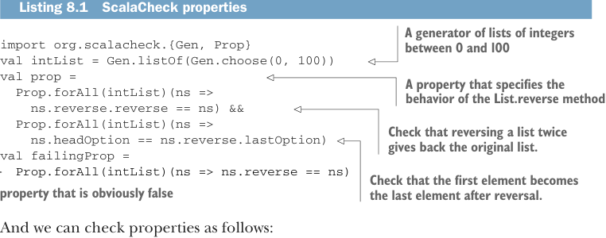

# Page 0209

[<- Page 0208](./page-0208) | [Pages index](./) | [Page 0210 ->](./page-0210)

> Part 2: Functional design and combinator libraries / Chapter 8: Property-based testing / 8.1 A brief tour of property-based testing

### 8.1 A brief tour of property-based testing

As an example, in ScalaCheck (http://mng.bz/n2j9), a property-based testing library for Scala, a property looks something like the following listing.



Listing 8.1 ScalaCheck properties

> A generator of lists of integers between 0 and 100

```scala
import org.scalacheck.{Gen, Prop}
val intList = Gen.listOf(Gen.choose(0, 100))
val prop =
Prop.forAll(intList)(ns =>
ns.reverse.reverse == ns) &&
Prop.forAll(intList)(ns =>
ns.headOption == ns.reverse.lastOption)
val failingProp =
```

> A property that specifies the behavior of the List.reverse method

> Check that reversing a list twice gives back the original list.

```scala
Prop.forAll(intList)(ns => ns.reverse == ns)
```

> Check that the first element becomes the last element after reversal. A property that is obviously false

And we can check properties as follows:

```scala
scala> prop.check
+ OK, passed 100 tests.
scala> failingProp.check
! Falsified after 6 passed tests.
> ARG_0: List(0, 1)
```

Here, `intList` is not a `List[Int]` but a `Gen[List[Int]]`, which is something that knows how to generate test data of the `List[Int]` type. We can sample from this generator, and it will produce lists of different lengths, filled with random numbers between 0 and 100. Generators in a property-based testing library have a rich API. We can combine and compose generators in different ways, reuse them, and so on. The function `Prop.forAll` creates a property by combining a generator of type `Gen[A]` with some predicate of type `A` `=>` `Boolean`. The property asserts that all values produced by the generator should satisfy the predicate. Figure 8.1 shows the relationship between the `intList` generator and one of the properties that uses it. Like generators, properties can also have a rich API. In this simple example, we’ve used `&&` to combine two properties. The resulting property will hold only if neither property can be falsified by any of the generated test cases. Together, the two properties form a partial specification of the correct behavior of the `reverse` method.1

When we invoke `prop.check`, ScalaCheck will randomly generate `List[Int]` values to try to find a case that falsifies the predicates we’ve supplied. The output indicates that ScalaCheck has generated 100 test cases (of type `List[Int]`) and that they all satisfied

1 The goal of this sort of testing is not necessarily fully specifying program behavior but providing greater confidence in the code. Like testing in general, we can always make our properties more complete, but we should do the usual cost–benefit analysis to determine whether the additional work is worth doing.

[<- Page 0208](./page-0208) | [Pages index](./) | [Page 0210 ->](./page-0210)
