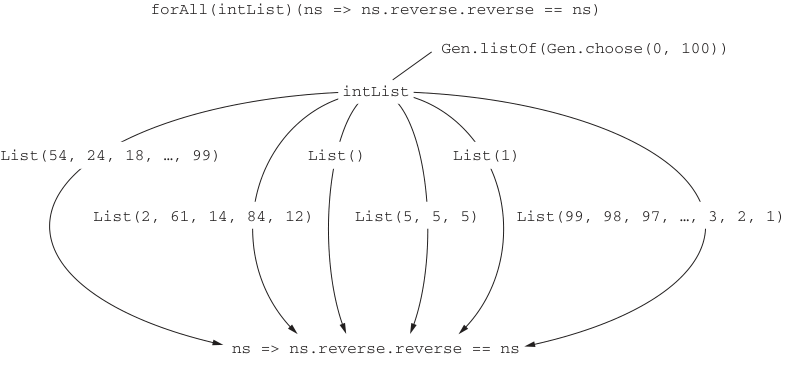

# Page 0210

[<- Page 0209](./page-0209) | [Pages index](./) | [Page 0211 ->](./page-0211)

> Part 2: Functional design and combinator libraries / Chapter 8: Property-based testing / 8.1 A brief tour of property-based testing

## 181 8.1 A brief tour of property-based testing

**Generators and properties**



```scala
forAll(intList)(ns => ns.reverse.reverse == ns)
Gen.listOf(Gen.choose(0, 100))
intList
List(54, 24, 18, …, 99)
List()
List(1)
List(2, 61, 14, 84, 12)
List(5, 5, 5)
List(99, 98, 97, …, 3, 2, 1)
ns => ns.reverse.reverse == ns
```

> A Gen object generates a variety of different objects to pass to a Boolean expression, searching for one that will make it false.

Figure 8.1 Generators and properties

the predicates. Properties can, of course, fail; the output of `failingProp.check` indicates that the predicate tested false for some input, which is helpfully printed out to facilitate further testing or debugging.


#### EXERCISE 8.1

To get used to thinking about testing in this way, come up with properties that specify the implementation of a `sum:` `List[Int]` `=>` `Int` function. You don’t have to write your properties down as executable ScalaCheck code—an informal description is fine. Here are some ideas to get you started:

Reversing a list and summing it should provide the same result as summing the original, nonreversed list.

What should the sum be if all elements of the list are of the same value?

Can you think of other properties?


#### EXERCISE 8.2

What properties specify a function that finds the maximum of a `List[Int]`?

[<- Page 0209](./page-0209) | [Pages index](./) | [Page 0211 ->](./page-0211)
