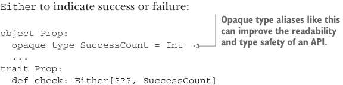

# Page 0214

[<- Page 0213](./page-0213) | [Pages index](./) | [Page 0215 ->](./page-0215)

> Part 2: Functional design and combinator libraries / Chapter 8: Property-based testing / 8.1 A brief tour of property-based testing / 8.1.3 The meaning and API of properties

## 185 8.1 A brief tour of property-based testing

In this representation, `Prop` is equivalent4 to a non-strict `Boolean`, and any of the usual `Boolean` functions (AND, OR, NOT, XOR, and so on) can be defined for `Prop`—but a `Boolean` alone is probably insufficient. If a property fails, we might want to know how many tests succeeded first and what arguments produced the failure, and if a property succeeds, it would be useful to know how many tests it ran. Let’s try returning an `Either` to indicate success or failure:



> Opaque type aliases like this can improve the readability and type safety of an API.

```scala
object Prop:
opaque type SuccessCount = Int
...
trait Prop:
def check: Either[???, SuccessCount]
```

What type shall we return in the failure case? We don’t know anything about the types of test cases being generated. Should we add a type parameter to `Prop` and make it `Prop[A]`? Then `check` could return `Either[A,Int]`. Before going too far down this path, let’s ask ourselves whether we really care about the type of the value that caused the property to fail. We don’t really; we would only care about the type if we were going to do further computation with the failure. Most likely we’re just going to end up printing it to the screen for inspection by the person running the tests. After all, the goal here is to find bugs and indicate to someone what test cases trigger those bugs so they can fix them. As a general rule, we shouldn’t use `String` to represent data we want to compute with. But for values, we’re just going to show to human beings that a `String` is absolutely appropriate. This suggests we can get away with the following representation for `Prop`:

```scala
object Prop:
opaque type FailedCase = String
opaque type SuccessCount = Int
trait Prop:
def check: Either[(FailedCase, SuccessCount), SuccessCount]
```

In case of failure, `check` returns a `Left((s,` `n))`, where `s` is some `String` that represents the value that caused the property to fail, and `n` is the number of cases that succeeded before the failure occurred. That takes care of the return value of `check`—at least for now—but what about the arguments to `check`? Right now, the `check` method takes no arguments. Is this sufficient? We can think about what information `Prop` will have access to just by inspecting the way `Prop` values are created. In particular, let’s look at `forAll`:

```scala
def forAll[A](a: Gen[A])(f: A => Boolean): Prop
```

4 It is equivalent in the sense that we could model a `Prop` as `() => Boolean`, instead of a trait with a single method, without losing any expressivity.

[<- Page 0213](./page-0213) | [Pages index](./) | [Page 0215 ->](./page-0215)
