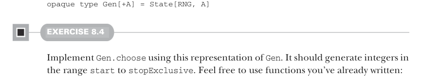

# Page 0215

[<- Page 0214](./page-0214) | [Pages index](./) | [Page 0216 ->](./page-0216)

> Part 2: Functional design and combinator libraries / Chapter 8: Property-based testing / 8.1 A brief tour of property-based testing / 8.1.4 The meaning and API of generators

Without knowing more about the representation of `Gen`, it’s hard to say whether there’s enough information here to be able to generate values of type `A` (which is what we need to implement `check`). So for now, let’s turn our attention to `Gen` to get a better idea of what it means and what its dependencies might be.

### 8.1.4 The meaning and API of generators We determined earlier that a Gen[A] is something that knows how to generate values of type A. What are some ways it could do that? Well, it could randomly generate these values. Look back at the example from chapter 6; in that chapter, we gave an interface for a purely functional random number generator, RNG, and showed how to make it convenient to combine computations that made use of it. We could just make Gen a type that wraps a State transition over a random number generator:5



```scala
opaque type Gen[+A] = State[RNG, A]
```

#### EXERCISE 8.4

Implement `Gen.choose` using this representation of `Gen`. It should generate integers in the range `start` to `stopExclusive`. Feel free to use functions you’ve already written:

```scala
def choose(start: Int, stopExclusive: Int): Gen[Int]
```


#### EXERCISE 8.5

Let’s see what else we can implement using this representation of `Gen`. Try implementing `unit`, `boolean`, and `listOfN`.

> Always generates the value a

```scala
def unit[A](a: => A): Gen[A]
def boolean: Gen[Boolean]
extension [A](self: Gen[A])
def listOfN[A](n: Int): Gen[List[A]]
```

> Generates lists of length n using the generator g

As we discussed in chapter 7, we’re interested in understanding what operations are primitive and what operations are derived as well as finding a small yet expressive set of primitives. A good way to explore what is expressible with a given set of primitives is picking some concrete examples you’d like to express and seeing if you can assemble the functionality you want. As you do so, look for patterns, try factoring out these patterns into combinators, and refine your set of primitives. We encourage you to stop reading here and simply play with the primitives and combinators we’ve written so far. If you want some concrete examples to inspire you, here are some ideas:

5 Recall the following definition: `opaque` `type` `State[S,` `+A]` `=` `S` `=>` `(A,` `S)`.

[<- Page 0214](./page-0214) | [Pages index](./) | [Page 0216 ->](./page-0216)
