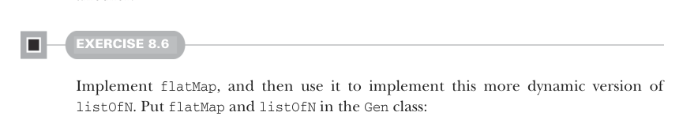

# Page 0216

[<- Page 0215](./page-0215) | [Pages index](./) | [Page 0217 ->](./page-0217)

> Part 2: Functional design and combinator libraries / Chapter 8: Property-based testing / 8.1 A brief tour of property-based testing / 8.1.5 Generators that depend on generated values

## 187 8.1 A brief tour of property-based testing

If we can generate a single `Int` in some range, do we need a new primitive to generate an `(Int,` `Int)` pair in some range?

Can we produce a `Gen[Option[A]]` from a `Gen[A]`? What about a `Gen[A]` from a `Gen[Option[A]]`?


Can we generate strings somehow using our existing primitives?

The importance of play You don’t have to wait around for a concrete example to force exploration of the design space. In fact, if you rely exclusively on concrete, obviously useful, or important examples to design your API, you’ll often miss out on aspects of the design space and generate APIs with ad hoc, overly specific features. We don’t want to overfit our design to the examples we happen to think of right now. We want to reduce the problem to its essence, and sometimes the best way of doing this is play. Don’t try solving important problems or producing useful functionality—not right away. Just experiment with different representations, primitives, and operations; let questions naturally arise; and explore whatever piques your curiosity. (You might think, *These two* *functions seem similar. I wonder if there’s some more general operation hiding inside;* *Would it make sense to make this data type polymorphic?*; or *What would it mean to* *change this aspect of the representation from a single value to a** *`List`* of values?*) There’s no right or wrong way of doing this, but there are so many different design choices that it’s impossible *not* to run headlong into fascinating questions to play with. It doesn’t matter where you begin—if you keep playing the domain will inexorably guide you to make all the design choices required.

### 8.1.5 Generators that depend on generated values

Suppose we’d like a `Gen[(String,` `String)]` that generates pairs, where the second string contains only characters from the first. Or suppose we had a `Gen[Int]` that chooses an integer between 0 and 11, and we’d like to make a `Gen[List[Double]]` that then generates lists of whatever length is chosen. In both of these cases, there’s a *dependency*: we generate a value, and then we use that value to determine what generator to use next. For this, we need `flatMap`, which lets one generator depend on another.



#### EXERCISE 8.6

Implement `flatMap`, and then use it to implement this more dynamic version of `listOfN`. Put `flatMap` and `listOfN` in the `Gen` class:

```scala
extension [A](self: Gen[A]) def flatMap[B](f: A => Gen[B]): Gen[B]
extension [A](self: Gen[A]) def listOfN(size: Gen[Int]): Gen[List[A]]
```

[<- Page 0215](./page-0215) | [Pages index](./) | [Page 0217 ->](./page-0217)
