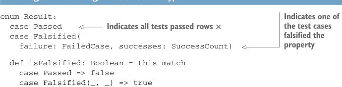
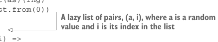

# Page 0218

[<- Page 0217](./page-0217) | [Pages index](./) | [Page 0219 ->](./page-0219)

> Part 2: Functional design and combinator libraries / Chapter 8: Property-based testing / 8.1 A brief tour of property-based testing / 8.1.6 Refining the Prop data type

## 189 8.1 A brief tour of property-based testing

success count. Since we don’t currently need any information in the `Right` case of that `Either`, we can turn it into an `Option`:

```scala
opaque type Prop = TestCases => Option[(FailedCase, SuccessCount)]
```

This seems a little weird, since `None` will mean all tests succeeded and the property passed, and `Some` will indicate a failure. Until now, we’ve only used the `None` case of `Option` to indicate failure, but in this case, we’re using it to represent the absence of a failure. That’s a perfectly legitimate use for `Option`, but its intent isn’t very clear. So let’s make a new data type, equivalent to `Option[(FailedCase,` `SuccessCount)]`, that shows our intent very clearly.

Listing 8.2 Creating a `Result` data type



> Indicates one of the test cases falsified the property

```scala
enum Result:
case Passed
case Falsified(
failure: FailedCase, successes: SuccessCount)
```

> Indicates all tests passed rows ×

```scala
def isFalsified: Boolean = this match
case Passed => false
case Falsified(_, _) => true
```

Is this now a sufficient representation of `Prop`? Let’s take another look at `forAll`. Can it be implemented? Why, or why not?

```scala
def forAll[A](a: Gen[A])(f: A => Boolean): Prop
```

We can see that `forAll` doesn’t have enough information to return a `Prop`. Besides the number of test cases to try, running a `Prop` must have all the information needed to generate test cases. If it needs to generate random test cases using our current representation of `Gen`, it’s going to need an `RNG`. Let’s propagate that dependency to `Prop`:

```scala
opaque type Prop = (TestCases, RNG) => Result
```

If we think of other dependencies it might need, besides the number of test cases and the source of randomness, we can just add these as extra parameters to `check` later. We now have enough information to implement `forAll`. The following listing shows a simple implementation.

Listing 8.3 Implementing `forAll`

```scala
def forAll[A](as: Gen[A])(f: A => Boolean): Prop =
(n, rng) =>
randomLazyList(as)(rng)
.zip(LazyList.from(0))
.take(n)
.map:
case (a, i) =>
try
```



> A lazy list of pairs, (a, i), where a is a random value and i is its index in the list

[<- Page 0217](./page-0217) | [Pages index](./) | [Page 0219 ->](./page-0219)
