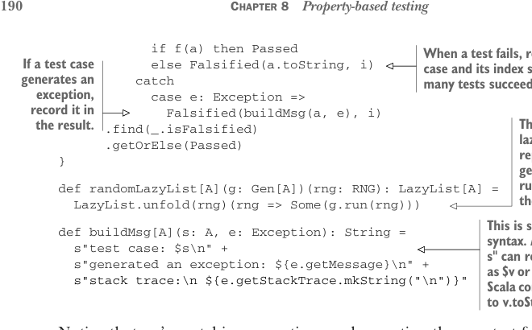

# Page 0219

[<- Page 0218](./page-0218) | [Pages index](./) | [Page 0220 ->](./page-0220)

> Part 2: Functional design and combinator libraries / Chapter 8: Property-based testing / 8.2 Test case minimization



```scala
if f(a) then Passed
else Falsified(a.toString, i)
catch
case e: Exception =>
Falsified(buildMsg(a, e), i)
.find(_.isFalsified)
.getOrElse(Passed)
}
```

> When a test fails, record the failed case and its index so we know how many tests succeeded before it. If a test case generates an exception, record it in the result. This generates an infinite lazy list of A values by repeatedly sampling a generator. Recall that run on a State evaluates the state action.

```scala
def randomLazyList[A](g: Gen[A])(rng: RNG): LazyList[A] =
LazyList.unfold(rng)(rng => Some(g.run(rng)))
```

> This is string interpolation syntax. A string starting with s" can refer to a Scala value v as $v or ${v} in the string. The Scala compiler will expand this to v.toString.

```scala
def buildMsg[A](s: A, e: Exception): String =
s"test case: $s\n" +
s"generated an exception: ${e.getMessage}\n" +
s"stack trace:\n ${e.getStackTrace.mkString("\n")}"
```

Notice that we’re catching exceptions and reporting them as test failures rather than letting the `run` throw the error (which would lose information about what argument triggered the failure).


#### EXERCISE 8.9

Now that we have a representation of `Prop`, implement `&&` and `||` for composing `Prop` values. Notice that in the case of failure, we don’t know which property was responsible—the left or right. Can you devise a way of handling this, perhaps by allowing `Prop` values to be assigned a tag or label that gets displayed in the event of a failure?

```scala
extension (self: Prop) def &&(that: Prop): Prop
extension (self: Prop) def ||(that: Prop): Prop
```

### 8.2 Test case minimization Earlier we mentioned the idea of test case minimization, meaning we’d ideally like our framework to find the smallest or simplest failing test case to better illustrate the problem and facilitate debugging. Let’s see if we can tweak our representations to support this outcome. There are two general approaches we could take:

*Shrinking*—After we’ve found a failing test case, we can run a separate procedure to minimize the test case by successively decreasing its size until it no longer fails. This is called *shrinking*, and it usually requires writing separate code for each data type to implement this minimization process.

*Sized generation*—Rather than shrinking test cases after the fact, we simply generate our test cases in order of increasing size and complexity, meaning we start small and increase the size until we find a failure. This idea can be extended in various ways to allow the test runner to make larger jumps in the space of possible sizes while still making it possible to find the smallest failing test.

[<- Page 0218](./page-0218) | [Pages index](./) | [Page 0220 ->](./page-0220)
