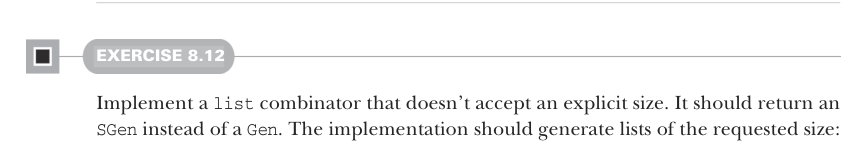

# Page 0220

[<- Page 0219](./page-0219) | [Pages index](./) | [Page 0221 ->](./page-0221)

> Part 2: Functional design and combinator libraries / Chapter 8: Property-based testing / 8.2 Test case minimization

## 191 8.2 Test case minimization

ScalaCheck, incidentally, takes the first approach: shrinking. There’s nothing wrong with this approach (it’s also used by the Haskell Free Library QuickCheck, which Scala- Check is based on: http://mng.bz/E24n), but we’ll see what we can do with sized generation. It’s a bit simpler and, in some ways, more modular because our generators only need to know how to generate a test case of a given size. They don’t need to be aware of the schedule used to search the space of test cases, and the function that runs the tests therefore has the freedom to choose this schedule. We’ll see how this plays out shortly. Instead of modifying our `Gen` data type, for which we’ve already written a number of useful combinators, let’s introduce sized generation as a separate layer in our library. A simple representation of a sized generator is just a function that takes a size and produces a generator:


```scala
opaque type SGen[+A] = Int => Gen[A]
```

#### EXERCISE 8.10

Implement a helper function for converting a `Gen` to an `SGen`, which ignores the size parameter. You can add this as an extension method on `Gen`:

```scala
extension [A](self: Gen[A]) def unsized: SGen[A]
```


#### EXERCISE 8.11

Not surprisingly, `SGen`, at a minimum, supports many of the same operations as `Gen`, and the implementations are rather mechanical. Define some convenience functions on `SGen` that simply delegate to the corresponding functions on `Gen`.7



#### EXERCISE 8.12

Implement a `list` combinator that doesn’t accept an explicit size. It should return an `SGen` instead of a `Gen`. The implementation should generate lists of the requested size:

```scala
extension [A](self: Gen[A]) def list: SGen[List[A]]
```


Let’s see how `SGen` affects the definition of `Prop` and `Prop.forAll`. The `SGen` equivalent of `forAll` looks like this:

> Without this annotation, forAll for an SGen conflicts with forAll for a Gen (assuming both are defined in the Prop companion). With this annotation, we disambiguate the compiled name, avoiding the conflict.

```scala
@annotation.targetName("forAllSized")
def forAll[A](g: SGen[A])(f: A => Boolean): Prop
```

7 In part 3, we’ll discuss ways of factoring out this sort of duplication.

[<- Page 0219](./page-0219) | [Pages index](./) | [Page 0221 ->](./page-0221)
