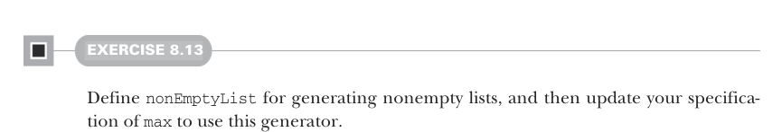
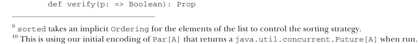

# Page 0223

[<- Page 0222](./page-0222) | [Pages index](./) | [Page 0224 ->](./page-0224)

> Part 2: Functional design and combinator libraries / Chapter 8: Property-based testing / 8.2 Test case minimization / 8.2.3 Writing a test suite for parallel computations



#### EXERCISE 8.13

Define `nonEmptyList` for generating nonempty lists, and then update your specification of `max` to use this generator.


Let’s try a few more examples.

#### EXERCISE 8.14

Write a property to verify the behavior of `List.sorted` (see the API docs: http://mng.bz/N4En), which you can use to sort (among other things) a `List[Int]`.9 For instance, `List(2,` `1,` `3).sorted` is equal to `List(1,` `2,` `3)`.

### 8.2.3 Writing a test suite for parallel computations

Recall that in chapter 7 we discovered laws that should hold for our parallel computations. Can we express these laws with our library? The first law we looked at was actually a particular test case:

```scala
unit(1).map(_ + 1) == unit(2)
```

We certainly can express this law for `Par`, but the result is somewhat complicated:10

```scala
val executor: ExecutorService = Executors.newCachedThreadPool
val p1 = Prop.forAll(Gen.unit(Par.unit(1)))(pi =>
pi.map(_ + 1).run(executor).get == Par.unit(2).run(executor).get)
```

We’ve expressed the test, but it’s verbose and cluttered, and the idea of the test is obscured by details that aren’t relevant here. Notice that this isn’t a question of the API being expressive enough—yes, we can express what we want, but a combination of missing helper functions and poor syntax obscures the intent.

PROVING PROPERTIES Let’s improve on this. Our first observation is that `forAll` is a bit too general for this test case. We aren’t varying the input to this test; we just have a hardcoded example. Hardcoded examples should be just as convenient to write as in a traditional unit testing library. Let’s introduce a combinator for it (on the `Prop` companion object):



```scala
def verify(p: => Boolean): Prop
```

9`sorted` takes an implicit* *`Ordering` for the elements of the list to control the sorting strategy. 10 This is using our initial encoding of `Par[A]` that returns a `java.util.concurrent.Future[A]` when run.

[<- Page 0222](./page-0222) | [Pages index](./) | [Page 0224 ->](./page-0224)
