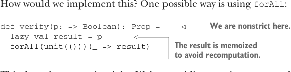

# Page 0224

[<- Page 0223](./page-0223) | [Pages index](./) | [Page 0225 ->](./page-0225)

> Part 2: Functional design and combinator libraries / Chapter 8: Property-based testing / 8.2 Test case minimization / 8.2.3 Writing a test suite for parallel computations

## 195 8.2 Test case minimization

How would we implement this? One possible way is using `forAll`:



> We are nonstrict here.

```scala
def verify(p: => Boolean): Prop =
lazy val result = p
forAll(unit(()))(_ => result)
```

> The result is memoized to avoid recomputation.

This doesn’t seem quite right. We’re providing a unit generator that only generates a single value, and then we’re proceeding to ignore that value just to drive the evaluation of the given `Boolean`. Even though we memoize the result so it’s not evaluated more than once, the test runner will still generate multiple test cases and test the `Boolean` multiple times. For example, if we say `verify(true).run()`, this will test the property 100 times and print `OK,` `passed` `100` `tests`. But checking a property that is always `true` 100 times is a terrible waste of effort. What we need is a new primitive. Remember that the representation of `Prop` we have so far is just a function of type `(MaxSize,` `TestCases,` `RNG)` `=>` `Result`, where `Result` is either `Passed` or `Falsified`. A simple implementation of a `verify` primitive is constructing a `Prop` that ignores the number of test cases:

```scala
def verify(p: => Boolean): Prop =
(_, _, _) => if p then Passed else Falsified("()", 0)
```

This is certainly better than using `forAll`, but `verify(true).run()` will still print `passed` `100` `tests`, even though it only tests the property once. It’s not really true that such a property has passed, in the sense that it remains unfalsified after a number of tests. It is proved after just one test. It seems we want a new kind of `Result`:

```scala
enum Result:
case Passed
case Falsified(failure: FailedCase, successes: SuccessCount)
case Proved
```

Then we can just return `Proved` instead of `Passed` in a property created by `verify`. We’ll need to modify the test runner to take this case into account.

Listing 8.7 Using `run` to handle a `Proved` object

```scala
extension (self: Prop)
def run(maxSize: MaxSize = 100,
testCases: TestCases = 100,
rng: RNG = RNG.Simple(System.currentTimeMillis)): Unit =
self(maxSize, testCases, rng) match
case Falsified(msg, n) =>
println(s"! Falsified after $n passed tests:\n $msg")
case Passed =>
println(s"+ OK, passed $testCases tests.")
case Proved =>
println(s"+ OK, proved property.")
```

[<- Page 0223](./page-0223) | [Pages index](./) | [Page 0225 ->](./page-0225)
