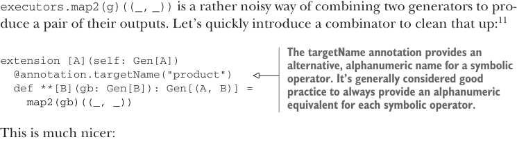

# Page 0226

[<- Page 0225](./page-0225) | [Pages index](./) | [Page 0227 ->](./page-0227)

> Part 2: Functional design and combinator libraries / Chapter 8: Property-based testing / 8.2 Test case minimization / 8.2.3 Writing a test suite for parallel computations

## 197 8.2 Test case minimization

```scala
val p4 = Prop.forAll(Gen.smallInt): i =>
equal(
Par.unit(i).map(_ + 1),
Par.unit(i + 1)
).run(executor).get
```

But while we’re at it, let’s move the running of `Par` out into a separate function: `forAllPar`. This also gives us a good place to insert variation across different parallel strategies, without it cluttering up the property we’re specifying:


```scala
val executors: Gen[ExecutorService] = weighted(
choose(1, 4).map(Executors.newFixedThreadPool) -> .75,
unit(Executors.newCachedThreadPool) -> .25)
```

> This generator creates a fixed thread pool executor 75% of the time and an unbounded one 25% of the time. a -> b is syntactic sugar for (a, b).

```scala
def forAllPar[A](g: Gen[A])(f: A => Par[Boolean]): Prop =
forAll(executors.map2(g)((_, _)))((s, a) => f(a).run(s).get)
```

`executors.map2(g)((_,` `_))` is a rather noisy way of combining two generators to produce a pair of their outputs. Let’s quickly introduce a combinator to clean that up:11



> The targetName annotation provides an alternative, alphanumeric name for a symbolic operator. It’s generally considered good practice to always provide an alphanumeric equivalent for each symbolic operator.

```scala
extension [A](self: Gen[A])
@annotation.targetName("product")
def **[B](gb: Gen[B]): Gen[(A, B)] =
map2(gb)((_, _))
```

This is much nicer:

```scala
def forAllPar[A](g: Gen[A])(f: A => Par[Boolean]): Prop =
forAll(executors ** g)((s, a) => f(a)(s).get)
```

We can even introduce `**` as a pattern using a custom extractor, which lets us write this:

```scala
def forAllPar[A](g: Gen[A])(f: A => Par[Boolean]): Prop =
forAll(executors ** g):
case s ** a =>
f(a)(s).get
```

This syntax works nicely when tupling up multiple generators; when pattern matching, we don’t have to nest parentheses like using the tuple pattern directly would require. To enable `**` as a pattern, we define an object called `**` with an `unapply` function:


```scala
object `**`:
```

> The backticks around ** are escapes, not part of the object name.

```scala
def unapply[A, B](p: (A, B)) = Some(p)
```

11 Calling this `**` is actually appropriate since this function is taking the *product* of two generators, in the sense we discussed in chapter 3.

[<- Page 0225](./page-0225) | [Pages index](./) | [Page 0227 ->](./page-0227)
