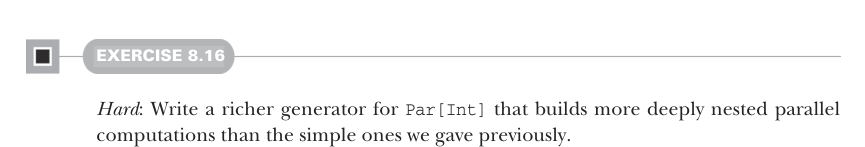

# Page 0228

[<- Page 0227](./page-0227) | [Pages index](./) | [Page 0229 ->](./page-0229)

> Part 2: Functional design and combinator libraries / Chapter 8: Property-based testing / 8.3 Testing higher-order functions and future directions

## 199 8.3 Testing higher-order functions and future directions

#### EXERCISE 8.16

*Hard*: Write a richer generator for `Par[Int]` that builds more deeply nested parallel computations than the simple ones we gave previously.

#### EXERCISE 8.17

Express the property about `fork` from chapter 7—that `fork(x)` `==` `x`.

### 8.3 Testing higher-order functions and future directions

So far, our library seems quite expressive, but there’s one area where it’s lacking: we don’t currently have a good way to test higher-order functions. While we have lots of ways of generating data using our generators, we don’t really have a good way of generating functions. For instance, let’s consider the `takeWhile` function defined for `List` and `LazyList`. Recall that this function returns the longest prefix of its input whose elements all satisfy a predicate—for instance, `List(1,` `2,` `3).takeWhile(_` `<` `3)` results in `List(1,` `2)`. A simple property we’d like to check is that for any list, `as:` `List[A]`, and any `f:` `A` `=>` `Boolean`, the expression `as.takeWhile(f).forall(f)` evaluates to `true`. That is, every element in the returned list satisfies the predicate.13

#### EXERCISE 8.18

Come up with some other properties that `takeWhile` should satisfy. Can you think of a good property expressing the relationship between `takeWhile` and `dropWhile`?

#### EXERCISE 8.19

*Hard*: We want to generate a function that uses its argument in some way to select which `Int` to return. Can you think of a good way of expressing this? This is a very open-ended and challenging design exercise. See what you can discover about this problem and if there’s a nice general solution you can incorporate into the library we’ve developed so far.

13 In the Scala standard library, `forall` is a method on `List` and `LazyList` with the signature `def forall` `[A](f: A => Boolean): Boolean`.

[<- Page 0227](./page-0227) | [Pages index](./) | [Page 0229 ->](./page-0229)
