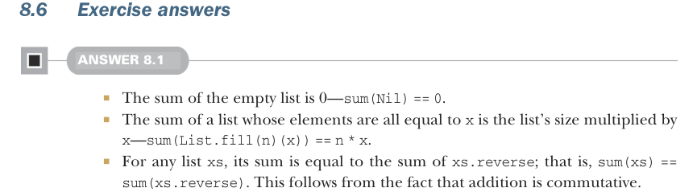
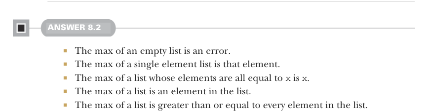

# Page 0231

[<- Page 0230](./page-0230) | [Pages index](./) | [Page 0232 ->](./page-0232)

> Part 2: Functional design and combinator libraries / Chapter 8: Property-based testing / 8.6 Exercise answers

If every possible input to a property is tested and all pass, then the property is proved true. If instead, the property simply does not fail for any of the generated inputs, then the property is passed. There might still be some input that wasn’t generated but fails the property.

Combinators like `map` and `flatMap` continue to appear in data types we create, and their implementations satisfy the same laws.



### 8.6 Exercise answers

#### ANSWER 8.1

The sum of the empty list is 0—`sum(Nil)` `==` `0`.

The sum of a list whose elements are all equal to `x` is the list’s size multiplied by `x`—`sum(List.fill(n)(x))` `==` `n` `*` `x`.

For any list `xs`, its sum is equal to the sum of `xs.reverse`; that is, `sum(xs)` `==` `sum(xs.reverse)`. This follows from the fact that addition is commutative.

For any list `xs`, partitioning it into two lists, summing each partitioning, and then adding the sums yields the same result as summing `xs`. This follows from the fact that addition is associative.

The sum of the list with elements 1, 2, 3…`n` is `n*(n+1)/2`.



#### ANSWER 8.2

The max of an empty list is an error.

The max of a single element list is that element.

The max of a list whose elements are all equal to `x` is `x`.

The max of a list is an element in the list.

The max of a list is greater than or equal to every element in the list.


#### ANSWER 8.3

Now that `check` returns a Boolean, we can implement `&&` to call `check` on the first property and, if that passes, call `check` on the argument:

```scala
trait Prop:
self =>
def check: Boolean
def &&(that: Prop): Prop =
new Prop:
def check = self.check && that.check
```

> This syntax introduces an alias for this, which we need later to refer to the outer Prop instance.

[<- Page 0230](./page-0230) | [Pages index](./) | [Page 0232 ->](./page-0232)
