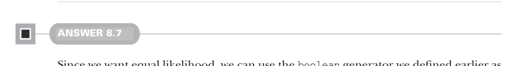
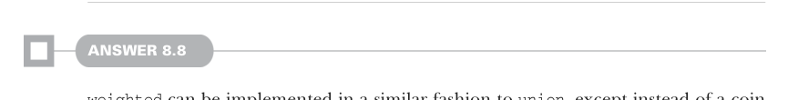
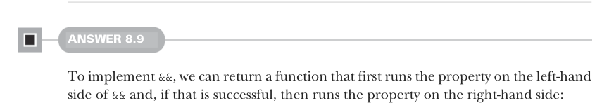

# Page 0233

[<- Page 0232](./page-0232) | [Pages index](./) | [Page 0234 ->](./page-0234)

> Part 2: Functional design and combinator libraries / Chapter 8: Property-based testing / 8.6 Exercise answers

`flatMap` on `State` but rather results in infinite recursion. We can indicate that we really want the method defined on `State` by directly calling the extension method:

```scala
extension [A](self: Gen[A]) def flatMap[B](f: A => Gen[B]): Gen[B] =
State.flatMap(self)(f)
```

Using `flatMap`, we can then implement the variant of `listOfN`, which takes a size as a `Gen[Int]` in terms of the `listOfN` method we defined earlier, which takes an integer size parameter:

```scala
extension [A](self: Gen[A]) def listOfN(size: Gen[Int]): Gen[List[A]] =
size.flatMap(listOfN)
```



#### ANSWER 8.7

Since we want equal likelihood, we can use the `boolean` generator we defined earlier as a coin flip, selecting `g1` when getting a `true` and `g2` when `false`. We use `flatMap` on `boolean` to be able to access the coin flip result when selecting the subsequent generator:

```scala
def union[A](g1: Gen[A], g2: Gen[A]): Gen[A] =
boolean.flatMap(b => if b then g1 else g2)
```



#### ANSWER 8.8

`weighted` can be implemented in a similar fashion to `union`, except instead of a coin flip, we compute the probability [0, 1). We then select `g1` when the generated probability is less than the normalized weighting:

```scala
def weighted[A](g1: (Gen[A], Double), g2: (Gen[A], Double)): Gen[A]
val g1Threshold = g1(1).abs / (g1(1).abs + g2(1).abs)
State(RNG.double).flatMap(d => if d < g1Threshold then g1(0) else g2(0))
```



#### ANSWER 8.9

To implement `&&`, we can return a function that first runs the property on the left-hand side of `&&` and, if that is successful, then runs the property on the right-hand side:

```scala
extension (self: Prop) def &&(that: Prop): Prop =
(n, rng) => self(n, rng) match
case Passed => that(n, rng)
case x => x
```

[<- Page 0232](./page-0232) | [Pages index](./) | [Page 0234 ->](./page-0234)
