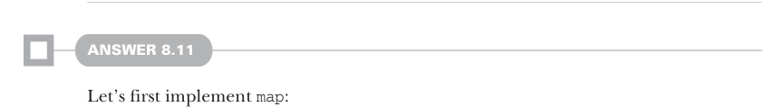

# Page 0235

[<- Page 0234](./page-0234) | [Pages index](./) | [Page 0236 ->](./page-0236)

> Part 2: Functional design and combinator libraries / Chapter 8: Property-based testing / 8.6 Exercise answers

```scala
extension (self: Prop) def tag(msg: String): Prop =
(n, rng) => self(n, rng) match
case Falsified(e, c) => Falsified(FailedCase.fromString(s"$msg($e)"), c)
case x => x
```

This implementation wraps the original error message with the message passed to tag, though a more sophisticated implementation could change the `Falsified` type to store a richer data structure, like a stack or tree of expressions. We also need to remember to use `tag` in the implementation of `&&` and `||`:

```scala
extension (self: Prop) def &&(that: Prop): Prop =
(n, rng) => self.tag("and-left")(n, rng) match
case Passed => that.tag("and-right")(n, rng)
case x => x
extension (self: Prop) def ||(that: Prop): Prop =
(n, rng) => self.tag("or-left")(n, rng) match
case Falsified(msg, _) =>
that.tag("or-right").tag(msg.string)(n, rng)
case x => x
```

Our error messages now give a hint about which parts of our properties are failing:

```scala
scala> (p && q).run()
! Falsified after 4 passed tests:
and-right(false)
scala> (q && p).run()
! Falsified after 1 passed tests:
and-left(false)
scala> (q || q).run()
! Falsified after 2 passed tests:
or-left(false)(or-right(false))
```


#### ANSWER 8.10

Since `SGen` is just a function from a size to a `Gen`, we can return an anonymous function that ignores the size parameter:

```scala
extension [A](self: Gen[A]) def unsized: SGen[A] =
_ => self
```



#### ANSWER 8.11

Let’s first implement `map`:

```scala
extension [A](self: SGen[A]) def map[B](f: A => B): SGen[B] =
n => self(n).map(f)
```

[<- Page 0234](./page-0234) | [Pages index](./) | [Page 0236 ->](./page-0236)
