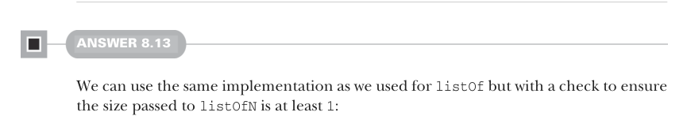

# Page 0236

[<- Page 0235](./page-0235) | [Pages index](./) | [Page 0237 ->](./page-0237)

> Part 2: Functional design and combinator libraries / Chapter 8: Property-based testing / 8.6 Exercise answers

## 207 8.6 Exercise answers

The implementation can be determined solely by following the types. We need to return an `SGen[B]`, so we build an anonymous function from a size (`n`) to a `Gen[B]`. To get a `Gen[B]` we apply the size parameter to the original `SGen[A]`, giving us a `Gen[A]`. Finally, we use our `map` function on `Gen` to convert that `Gen[A]` to a `Gen[B]`. This typeguided implementation is what we mean by *mechanical*. Let’s do one more—`flatMap`:

```scala
extension [A](self: SGen[A]) def flatMap[B](f: A => SGen[B]): SGen[B] =
n => self(n).flatMap(a => f(a)(n))
```

Using the same technique, we return an anonymous function that takes a size and returns a `Gen[B]`. We apply the size to our original `SGen[A]`, giving us a `Gen[A]`. We call `flatMap` on that `Gen[A]`, but we can’t just pass `f` to `flatMap` like we did with `map`; `flatMap` wants a function `A` `=>` `Gen[B]`. So we pass a function that first applies `a` to `f`, returning an `SGen[B]` and then applying the size parameter to that `SGen[B]` to convert it to a `Gen[B]`.


#### ANSWER 8.12

We can return an anonymous function that takes a size as an argument and applies it to the `listOfN` method we wrote earlier:

```scala
extension [A](self: Gen[A]) def list: SGen[List[A]] =
n => self.listOfN(n)
```



#### ANSWER 8.13

We can use the same implementation as we used for `listOf` but with a check to ensure the size passed to `listOfN` is at least `1`:

```scala
extension [A](self: Gen[A]) def nonEmptyList: SGen[List[A]] =
n => listOfN(n.max(1))
val maxProp = Prop.forAll(smallInt.nonEmptyList): ns =>
val max = ns.max
!ns.exists(_ > max)
scala> maxProp.run()
+ OK, passed 100 tests.
```

[<- Page 0235](./page-0235) | [Pages index](./) | [Page 0237 ->](./page-0237)
