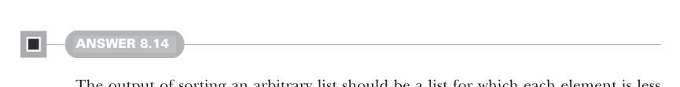
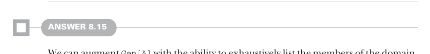

# Page 0237

[<- Page 0236](./page-0236) | [Pages index](./) | [Page 0238 ->](./page-0238)

> Part 2: Functional design and combinator libraries / Chapter 8: Property-based testing / 8.6 Exercise answers



#### ANSWER 8.14

The output of sorting an arbitrary list should be a list for which each element is less than or equal to the next element. We can write this as a property by zipping the elements of a list with its tail and then verifying that every pair adheres to this ordering requirement. We also need to verify that the sorted list has all the elements in the original list and no other elements:

```scala
val sortedProp = Prop.forAll(smallInt.list): l =>
val ls = l.sorted
val ordered = l.isEmpty || ls.zip(ls.tail).forall((a, b) => a <= b)
ordered && l.forall(ls.contains) && ls.forall(l.contains)
```



#### ANSWER 8.15

We can augment `Gen[A]` with the ability to exhaustively list the members of the domain, while retaining the ability to select random samples and describe infinite domains. One such encoding is pairing a random generator with an exhaustive list of elements:

```scala
case class Gen[+A](sample: State[RNG, A], exhaustive: LazyList[Option[A]])
```

Here we’ve chosen to model a finite, exhaustive list of domain elements as a lazy list of options. The list provides each value of the domain wrapped in a `Some`, until we’ve enumerated every element, and then returns an empty list. For infinite domains, we set `exhaustive` to a list of a single `None`, indicating that the domain was not exhaustively enumerated. Can we implement `map2` for this new version of `Gen`? Yes! Let’s take a look:

```scala
case class Gen[+A](sample: State[RNG, A], exhaustive: LazyList[Option[A]]):
def map2[B, C](g: Gen[B])(f: (A, B) => C): Gen[C] =
Gen(sample.map2(g.sample)(f),
map2LazyList(exhaustive, g.exhaustive)(map2Option(_,_)(f)))
```

Here we use `map2` on `LazyList` and `Option` to combine the `exhaustive` values.14 This is pretty powerful! We can generate the Cartesian product of two or more exhaustive generators. Next we need to modify `forAll` to use this new `Gen` type. Remember that a `Prop` is a function from `(MaxSize,` `TestCases,` `RNG)` to `Result`. Of particular interest is the `TestCases` argument, which may be smaller than the number of elements in the domain. We should respect the specified number of test cases when running a property.

14 The definitions of `map2LazyList` and `map2Option` are elided here (see `Exhaustive.scala` in the answer source code accompanying this chapter).

[<- Page 0236](./page-0236) | [Pages index](./) | [Page 0238 ->](./page-0238)
