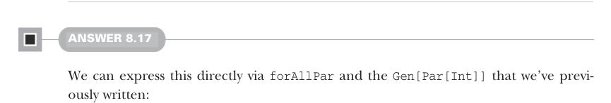

# Page 0239

[<- Page 0238](./page-0238) | [Pages index](./) | [Page 0240 ->](./page-0240)

> Part 2: Functional design and combinator libraries / Chapter 8: Property-based testing / 8.6 Exercise answers

Here’s a sample usage:

```scala
scala> val andCommutative =
Prop.forAll(Gen.boolean.map2(Gen.boolean)((_, _))):
(p, q) => (p && q) == (q && p))
scala> andCommutative.run()
+ OK, property proven, ran 4 tests.
```

The source code in the accompanying GitHub repository extends this solution to cover sized generators.


#### ANSWER 8.16

One technique is generating a `List[Int]` and then folding that list into a single `Par[Int]`, where each combination forks the computation:

```scala
val gpy2: Gen[Par[Int]] =
choose(-100, 100).listOfN(choose(0, 20)).map(ys =>
ys.foldLeft(Par.unit(0))((p, y) =>
Par.fork(p.map2(Par.unit(y))(_ + _))))
```

We create a `Gen[List[Int]]` via `choose(-100,` `100).listOfN(choose(0,` `20))`. We then map over that generator and reduce the list to a single `Par[Unit]` by using `fork` and `map2`. We could extract a new generic function on lists, `parTraverse`, and use it to implement our generator:

```scala
extension [A](self: List[A])
def parTraverse[B](f: A => Par[B]): Par[List[B]] =
self.foldRight(Par.unit(Nil: List[B]))((a, pacc) =>
Par.fork(f(a).map2(pacc)(_ :: _)))
val gpy3: Gen[Par[Int]] =
choose(-100, 100).listOfN(choose(0, 20)).map(ys =>
ys.parTraverse(Par.unit).map(_.sum))
```



#### ANSWER 8.17

We can express this directly via `forAllPar` and the `Gen[Par[Int]]` that we’ve previously written:

```scala
val forkProp = Prop.forAllPar(gpy2)(y => equal(Par.fork(y), y))
```

[<- Page 0238](./page-0238) | [Pages index](./) | [Page 0240 ->](./page-0240)
