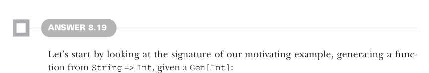

# Page 0241

[<- Page 0240](./page-0240) | [Pages index](./) | [Page 0242 ->](./page-0242)

> Part 2: Functional design and combinator libraries / Chapter 8: Property-based testing / 8.6 Exercise answers



#### ANSWER 8.19

Let’s start by looking at the signature of our motivating example, generating a function from `String` `=>` `Int`, given a `Gen[Int]`:

```scala
def genStringIntFn(g: Gen[Int]): Gen[String => Int]
```

Now let’s generalize this a bit so it isn’t specialized to `Int`, because that would let us cheat (by, say, returning the `hashCode` of the input `String`, which just so happens to be an `Int`):

```scala
def genStringFn[A](g: Gen[A]): Gen[String => A]
```

We’ve already ruled out just returning a function that ignores the input `String`, since that’s not very interesting! Instead, we want to make sure we use information from the input `String` to influence which `A` we generate. How can we do that? The only way we can have any influence on what value a `Gen` produces is by modifying the `RNG` value it receives as input. Recall our definition of `Gen`:

```scala
opaque type Gen[+A] = State[RNG, A]
```

Just by following the types, we can start writing the following:

```scala
def genStringFn[A](g: Gen[A]): Gen[String => A] =
State[RNG, String => A]: rng => ???
```

`???` has to be of type `(String` `=>` `A,` `RNG)`, and moreover, we want `String` to somehow affect which `A` is generated. We do that by modifying the seed of the `RNG` before passing it to the `Gen[A]` sample function. A simple way of doing this is computing the hash of the input string and mixing this into the `RNG` state before using it to produce an `A`:


```scala
def genStringFn[A](g: Gen[A]): Gen[String => A] =
State[RNG, String => A]: rng =>
val (seed, rng2) = rng.nextInt
val f = (s: String) =>
g.run(RNG.Simple(seed.toLong ^ s.hashCode.toLong))(0)
(f, rng2)
```

> We still use rng to produce a seed, so we get a new function each time.

More generally, any function that takes a `String` and an `RNG` and produces a new `RNG` could be used. Here we’re computing the `hashCode` of the `String` and then using exclusive or (XOR) with a seed value to produce a new `RNG`. We could just as easily take the length of the `String` and use this value to perturb our RNG state or take the first three characters of the string. The choices affect what type of function we are producing:

[<- Page 0240](./page-0240) | [Pages index](./) | [Page 0242 ->](./page-0242)
