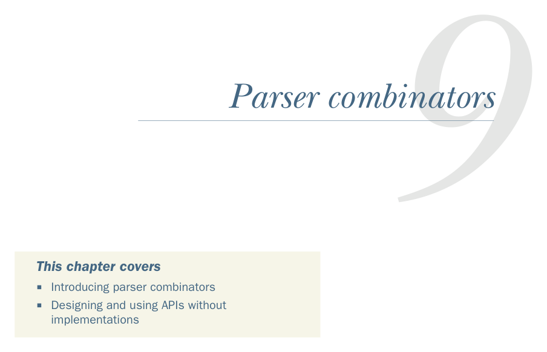

# Page 0243

[<- Page 0242](./page-0242) | [Pages index](./) | [Page 0244 ->](./page-0244)

> Part 2: Functional design and combinator libraries / Chapter 9: Parser combinators

*Parser combinators*

### This chapter covers

Introducing parser combinators

Designing and using APIs without implementations

In this chapter, we’ll work through the design of a combinator library for creating *parsers*. We’ll use JSON parsing (http://mng.bz/DpNA) as a motivating use case. Like chapters 7 and 8, this chapter is not so much about parsing as it is about providing further insight into the process of functional design.

What is a parser? A parser is a specialized program that takes unstructured data (e.g., text or any kind of stream of symbols, numbers, or tokens) as input, and outputs a structured representation of that data. For example, we can write a parser to turn a comma-separated file into a list of lists, where the elements of the outer list represent the records, and the elements of each inner list represent the comma-separated fields of each record. Another example is a parser that takes an XML or JSON document and turns it into a tree-like data structure.

**214**

[<- Page 0242](./page-0242) | [Pages index](./) | [Page 0244 ->](./page-0244)
