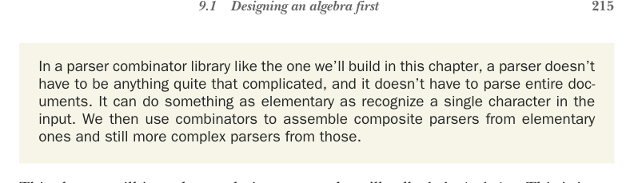

# Page 0244

[<- Page 0243](./page-0243) | [Pages index](./) | [Page 0245 ->](./page-0245)

> Part 2: Functional design and combinator libraries / Chapter 9: Parser combinators / 9.1 Designing an algebra first

## 215 9.1 Designing an algebra first

In a parser combinator library like the one we’ll build in this chapter, a parser doesn’t have to be anything quite that complicated, and it doesn’t have to parse entire documents. It can do something as elementary as recognize a single character in the input. We then use combinators to assemble composite parsers from elementary ones and still more complex parsers from those.

This chapter will introduce a design approach we’ll call *algebraic design*. This is just a natural evolution of what we’ve already done to different degrees in past chapters— designing our interface first, along with associated laws, and letting this guide our choice of data type representations. At a few key points during this chapter, we’ll provide more open-ended exercises intended to mimic the scenarios you might encounter when writing your own libraries from scratch. You’ll get the most out of this chapter if you use these opportunities to put the book down and spend some time investigating possible approaches. When you design your own libraries, you won’t be handed a nicely chosen sequence of type signatures to fill in with implementations. You’ll have to make the decisions about what types and combinators you need, and a goal of part 2 of this book has been preparing you to do this on your own. As always, if you get stuck on one of the exercises or want some more ideas, you can keep reading or consult the answers. It may also be a good idea to do these exercises with another person or compare notes with other readers online.

Parser combinators versus parser generators You might be familiar with *parser generator* libraries, like Yacc (http://mng.bz/w3zZ), or similar libraries in other languages (e.g., ANTLR in Java: http://mng.bz/aj8K). These libraries generate code for a parser based on a specification of the grammar. This approach works fine and can be quite efficient, but it comes with all the usual problems of code generation: the libraries produce as their output a monolithic chunk of code that’s difficult to debug. It’s also difficult to reuse fragments of logic since we can’t introduce new combinators or helper functions to abstract over common patterns in our parsers.

In a parser combinator library, parsers are just ordinary first-class values. The resulting parsers tend to be slower than those generated by tools like Yacc and ANTLR, and we need to reimplement the grammar in terms of the parser combinators. Reusing parsing logic is trivial, though, and we don’t need any sort of external tool separate from our programming language.

### 9.1 Designing an algebra first

Recall that we defined an *algebra* as a collection of functions operating over some data type(s), along with a set of laws specifying relationships between these functions. In past chapters, we moved rather fluidly between inventing functions in our algebra,

[<- Page 0243](./page-0243) | [Pages index](./) | [Page 0245 ->](./page-0245)
