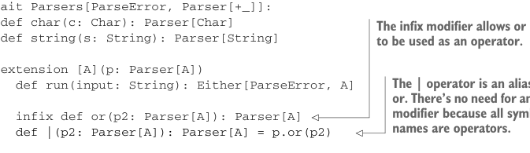

# Page 0247

[<- Page 0246](./page-0246) | [Pages index](./) | [Page 0248 ->](./page-0248)

> Part 2: Functional design and combinator libraries / Chapter 9: Parser combinators / 9.1 Designing an algebra first

But choosing between two parsers seems like something that would be more generally useful, regardless of their result type, so let’s make this polymorphic:

```scala
extension [A](p: Parser[A]) def or(p2: Parser[A]): Parser[A]
```

We expect that `string("abra").or(string("cadabra"))` will succeed whenever either `string` parser succeeds:

```scala
string("abra").or(string("cadabra")).run("abra") == Right("abra")
string("abra").or(string("cadabra")).run("cadabra") == Right("cadabra")
```

Incidentally, we can give this `or` combinator nice infix syntax, like `s1` `|` `s2` or, alternately, `s1` `or` `s2`.

Listing 9.1 Adding infix syntax to parsers

```scala
trait Parsers[ParseError, Parser[+_]]:
def char(c: Char): Parser[Char]
def string(s: String): Parser[String]
```



> The infix modifier allows or to be used as an operator.

```scala
extension [A](p: Parser[A])
def run(input: String): Either[ParseError, A]
```

> The | operator is an alias for or. There’s no need for an infix modifier because all symbolic names are operators.

```scala
infix def or(p2: Parser[A]): Parser[A]
def |(p2: Parser[A]): Parser[A] = p.or(p2)
```

We haven’t yet picked a representation of `Parser`, but given a value `P` of type `Parsers`, writing `import` `P.*` lets us write expressions like `string("abra")` `|` `string("cadabra")` to create parsers. This will work for all implementations of `Parsers`. We’ll use the `a` `|` `b` syntax liberally throughout the rest of this chapter. We can now recognize various strings, but we don’t have a way of talking about repetition. For instance, how would we recognize three repetitions of our `string("abra")` `|` `string("cadabra")` parser? Once again, let’s add a combinator for it:6

```scala
extension [A](p: Parser[A]) def listOfN(n: Int): Parser[List[A]]
```

We made `listOfN` parametric in the choice of `A` since it doesn’t seem like it should care whether we have a `Parser[String]`, a `Parser[Char]`, or some other type of parser. Here are some examples of what we expect from `listOfN`:

```scala
val p = (string("ab") | string("cad")).listOfN(3)
p.run("ababcad") == Right(List("ab", "ab", "cad"))
p.run("cadabab") == Right(List("cad", "ab", "ab"))
p.run("ababab") == Right(List("ab", "ab", "ab"))
```

6 This should remind you of a similar function we wrote in the previous chapter.

[<- Page 0246](./page-0246) | [Pages index](./) | [Page 0248 ->](./page-0248)
