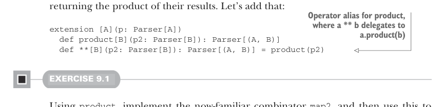

# Page 0251

[<- Page 0250](./page-0250) | [Pages index](./) | [Page 0252 ->](./page-0252)

> Part 2: Functional design and combinator libraries / Chapter 9: Parser combinators / 9.2 A possible algebra / 9.2.1 Slicing and nonempty repetition

### 9.2.1 Slicing and nonempty repetition

The combination of `many` and `map` certainly lets us express the parsing task of counting the number of `'a'` characters, but it seems inefficient to construct a `List[Char]` only to discard its values and extract its length. It would be nice if we could run a `Parser` purely to see what portion of the input string it examines. Let’s conjure up a combinator for that purpose:

```scala
extension [A](p: Parser[A]) def slice: Parser[String]
```

We call this combinator `slice`, since we intend for it to return the portion of the input string examined by the parser if successful. As an example, `(char('a')` `|` `char('b')).many.slice.run("aaba")` results in `Right("aaba")`; we ignore the list accumulated by `many` and simply return the portion of the input string matched by the parser. With `slice`, our parser that counts `'a'` characters can now be written as `char('a').many.slice.map(_.size)`. The `_.size` function here is now referencing the `size` method on `String`, which takes constant time, rather than the `size` method on `List`, which takes time proportional to the length of the list (and requires us to actually construct the list). Note that there’s no implementation here yet; we’re still just coming up with our desired interface. But `slice` does put a constraint on the implementation—namely, that even if the parser `p.many.map(_.size)` will generate an intermediate list when run, `p.many.slice.map(_.size)` will not. This is a strong hint that `slice` is primitive, since it will have to have access to the internal representation of the parser. Let’s consider the next use case. What if we want to recognize one or more `'a'` characters? First we introduce a new combinator for it—`many1`:

```scala
extension [A](p: Parser[A]) def many1: Parser[List[A]]
```

It feels like `many1` shouldn’t have to be primitive, but it should be defined somehow in terms of `many`. Really, `p.many1` is just `p` followed by `p.many`. So it seems we need some way of running one parser followed by another, assuming the first is successful, and returning the product of their results. Let’s add that:



> Operator alias for product, where a ** b delegates to a.product(b)

```scala
extension [A](p: Parser[A])
def product[B](p2: Parser[B]): Parser[(A, B)]
def **[B](p2: Parser[B]): Parser[(A, B)] = product(p2)
```

#### EXERCISE 9.1

Using `product`, implement the now-familiar combinator `map2`, and then use this to implement `many1` in terms of `many`. Note that we could have chosen to make `map2` primitive and defined `product` in terms of `map2`, as we’ve done in previous chapters. The choice is up to you:

[<- Page 0250](./page-0250) | [Pages index](./) | [Page 0252 ->](./page-0252)
