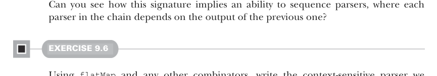

# Page 0254

[<- Page 0253](./page-0253) | [Pages index](./) | [Page 0255 ->](./page-0255)

> Part 2: Functional design and combinator libraries / Chapter 9: Parser combinators / 9.3 Handling context sensitivity

## 225 9.3 Handling context sensitivity

### 9.3 Handling context sensitivity

Let’s take a step back and look at the primitives we have so far:

 `string(s)`—Recognizes and returns a single `String`

 `p.slice`—Returns the portion of input inspected by `p` if successful

 `succeed(a)`—Always succeeds with the value `a`

 `p.map(f)`—Applies the function `f` to the result of `p`, if successful

 `p1.product(p2)`—Sequences two parsers, running `p1` and then `p2`, and returns the pair of their results if both succeed

 `p1` `or` `p2`—Chooses between two parsers, first attempting `p1` and then `p2` if `p1` fails

Using these primitives, we can express repetition and nonempty repetition (`many`, `listOfN`, and `many1`), as well as combinators like `char` and `map2`. Would it surprise you if these primitives were sufficient for parsing any context-free grammar, including JSON? Well, they are! We’ll start writing that JSON parser soon, but what can’t we express yet? Suppose we want to parse a single digit, like `'4'`, followed by many `'a'` characters (this sort of problem should feel familiar from previous chapters). Examples of valid inputs include `"0"`, `"1a"`, `"2aa"`, `"4aaaa"`, and so on. This is an example of a contextsensitive grammar. It can’t be expressed with `product` because our choice of the second parser depends on the result of the first (the second parser depends on its context). We want to run the first parser and then do a `listOfN` using the number extracted from the first parser’s result. Can you see why `product` can’t express this? This progression might feel familiar to you. In past chapters, we encountered similar expressiveness limitations and dealt with them by introducing a new primitive: `flatMap`. Let’s introduce that here:

```scala
extension [A](p: Parser[A]) def flatMap[B](f: A => Parser[B]): Parser[B]
```



Can you see how this signature implies an ability to sequence parsers, where each parser in the chain depends on the output of the previous one?

#### EXERCISE 9.6

Using `flatMap` and any other combinators, write the context-sensitive parser we couldn’t express earlier. To parse the digits, you can make use of a new primitive, `regex`, which promotes a regular expression to a `Parser`.10 In Scala, a string `s` can be promoted to a `Regex` object (which has methods for matching) using `s.r`—for instance, `"[a-zA-Z_][a-zA-Z0-9_]*".r`:

```scala
def regex(r: Regex): Parser[String]
```

10In theory, this isn’t necessary; we could write out `string("0")` `|` `string("1")` `|` `…` `string("9")` to recognize a single digit, but this isn’t likely to be very efficient.

[<- Page 0253](./page-0253) | [Pages index](./) | [Page 0255 ->](./page-0255)
