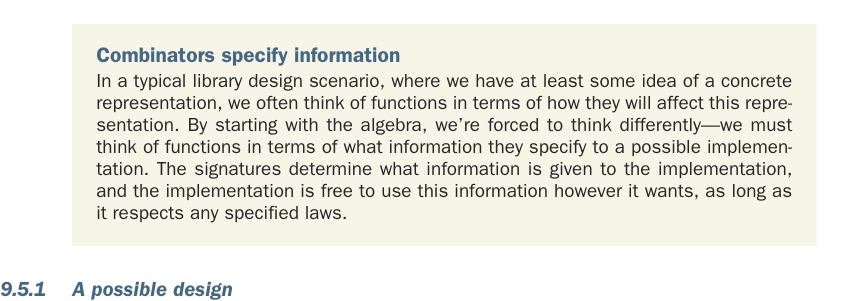

# Page 0258

[<- Page 0257](./page-0257) | [Pages index](./) | [Page 0259 ->](./page-0259)

> Part 2: Functional design and combinator libraries / Chapter 9: Parser combinators / 9.5 Error reporting / 9.5.1 A possible design

## 229 9.5 Error reporting

#### EXERCISE 9.10

*Hard*: If you haven’t already done so, spend some time discovering a nice set of combinators for expressing what errors get reported by a `Parser`. For each combinator, try to come up with laws specifying what its behavior should be. This is a very open-ended design task; here are some guiding questions:

Given the parser `string("abra")` `**` `string("` `").many` `**` `string("cadabra")`, what sort of error would you like to report, given the input `"abra` `cAdabra"` (note the capital `'A'`)—something like `Expected` `'a'` or `Expected` `"cadabra"`? What if you wanted to choose a different error message, like `"Magic` `word` `incorrect,` `try` `again!"`?

Given `a` `or` `b`, if `a` fails on the input, do we always want to run `b`, or are there cases when we might not want to? If there are such cases, can you think of additional combinators that would allow the programmer to specify when `or` should consider the second parser?

How do you want to handle reporting the location of errors?

Given `a` `|` `b`, if `a` and `b` both fail on the input, might we want to support reporting both errors? And do we always want to report both errors, or do we want to give the programmer a way to specify which of the two errors is reported?

We suggest you continue reading once you’re satisfied with your design. The next section works through a possible design in detail.

Combinators specify information In a typical library design scenario, where we have at least some idea of a concrete representation, we often think of functions in terms of how they will affect this representation. By starting with the algebra, we’re forced to think differently—we must think of functions in terms of what information they specify to a possible implementation. The signatures determine what information is given to the implementation, and the implementation is free to use this information however it wants, as long as it respects any specified laws.

### 9.5.1 A possible design

Now that you’ve spent some time coming up with some good error-reporting combinators, we’ll work through one possible design. Again, you may have arrived at a different design, and that’s totally fine. This is just another opportunity to see a worked design process.

[<- Page 0257](./page-0257) | [Pages index](./) | [Page 0259 ->](./page-0259)
