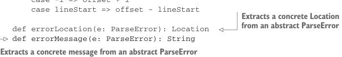
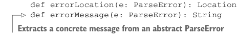

# Page 0259

[<- Page 0258](./page-0258) | [Pages index](./) | [Page 0260 ->](./page-0260)

> Part 2: Functional design and combinator libraries / Chapter 9: Parser combinators / 9.5 Error reporting / 9.5.2 Error nesting

We’ll progressively introduce our error-reporting combinators. To start, let’s introduce an obvious one. None of the primitives so far let us assign an error message to a parser. We can introduce a primitive combinator for this—`label`:

```scala
extension [A](p: Parser[A]) def label(msg: String): Parser[A]
```

The intended meaning of `label` is that if `p` fails, its `ParseError` will somehow incorporate `msg`. What does this mean exactly? Well, we could just assume `type` `ParseError` `=` `String` and that the returned `ParseError` will equal the label, but we’d like our parse error to also tell us where the problem occurred. Let’s tentatively add this to our algebra:

```scala
case class Location(input: String, offset: Int = 0):
lazy val line = input.slice(0, offset + 1).count(_ == '\n') + 1
lazy val col = input.slice(0, offset + 1).lastIndexOf('\n') match
case -1 => offset + 1
case lineStart => offset - lineStart
```



> Extracts a concrete Location from an abstract ParseError



```scala
def errorLocation(e: ParseError): Location
def errorMessage(e: ParseError): String
```

> Extracts a concrete message from an abstract ParseError

We’ve picked a concrete representation for `Location` here that includes the full input, an offset into this input, and the line and column numbers, which can be computed lazily from the full input and offset. We can now say more precisely what we expect from `label`. In the event of failure with `Left(e)`, `errorMessage(e)` will equal the message set by `label`. This can be specified with a `Prop`:

```scala
def labelLaw[A](p: Parser[A], inputs: SGen[String]): Prop =
forAll(inputs ** Gen.string):
case (input, msg) =>
p.label(msg).run(input) match
case Left(e) => errorMessage(e) == msg
case _ => true
```

What about the `Location`? We’d like this to be filled in by the `Parsers` implementation with the location where the error occurred. This notion is still a bit fuzzy; if we have `a` `|` `b`, and both parsers fail on the input, which location and label(s) are reported? We’ll discuss this in the next section.

### 9.5.2 Error nesting

Is the `label` combinator sufficient for all our error-reporting needs? Not quite. Let’s look at an example:

```scala
val p = string("abra").label("first magic word") **
string(" ").many **
string("cadabra").label("second magic word")
```

> Skip the whitespace.

[<- Page 0258](./page-0258) | [Pages index](./) | [Page 0260 ->](./page-0260)
