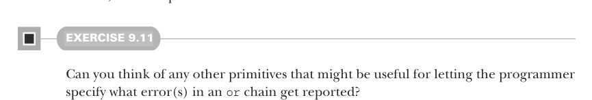

# Page 0262

[<- Page 0261](./page-0261) | [Pages index](./) | [Page 0263 ->](./page-0263)

> Part 2: Functional design and combinator libraries / Chapter 9: Parser combinators / 9.6 Implementing the algebra

## 233 9.6 Implementing the algebra

Here `fail` is a parser that always fails. That is, even if `p` fails midway through examining the input, `attempt` reverts the commit to that parse and allows `p2` to be run. The `attempt` combinator can be used whenever there’s ambiguity in the grammar, and multiple tokens may have to be examined before the ambiguity can be resolved and parsing can commit to a single branch. As an example, we might write this:

```scala
((string("abra") ** spaces ** string("abra")).attempt **
string("cadabra")) | ("abra" ** spaces ** "cadabra!")
```

Suppose this parser is run on `"abra` `cadabra!"`—after parsing the first `"abra"`, we don’t know whether to expect another `"abra"` (the first branch) or `"cadabra!"` (the second branch). By wrapping an `attempt` around `"abra"` `**` `spaces` `**` `"abra"`, we allow the second branch to be considered up until we’ve finished parsing the second `"abra"`, at which point we commit to that branch.



#### EXERCISE 9.11

Can you think of any other primitives that might be useful for letting the programmer specify what error(s) in an `or` chain get reported?

We still haven’t written an implementation of our algebra! But this exercise has been more about making sure our combinators provide a way for users of our library to convey the right information to the implementation. It’s up to the implementation to figure out how to use this information in a way that satisfies the laws we’ve stipulated.

### 9.6 Implementing the algebra By this point, we’ve fleshed out our algebra and defined a Parser[JSON] in terms of it.14 Aren’t you curious to try running it? Let’s again recall our set of primitives:

 `string(s)`—Recognizes and returns a single `String`

 `regex(s)`—Recognizes a regular expression `s`

 `p.slice`—Returns the portion of input inspected by `p`, if successful

 `p.label(e)`—In the event of failure, replaces the assigned message with `e`

 `p.scope(e)`—In the event of failure, adds `e` to the error stack returned by `p`

 `f.flatMap(p)`—Runs a parser and then uses its result to select a second parser to run in sequence

 `p.attempt`—Delays committing to `p` until after it succeeds

 `p1` `|` `p2`—Chooses between two parsers, first attempting `p1` and then `p2` if `p1` fails in an uncommitted state on the input

14 You may want to revisit your parser to make use of some of the error-reporting combinators we discussed in the previous section.

[<- Page 0261](./page-0261) | [Pages index](./) | [Page 0263 ->](./page-0263)
