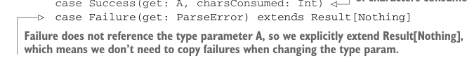

# Page 0264

[<- Page 0263](./page-0263) | [Pages index](./) | [Page 0265 ->](./page-0265)

> Part 2: Functional design and combinator libraries / Chapter 9: Parser combinators / 9.6 Implementing the algebra / 9.6.2 Sequencing parsers

## 235 9.6 Implementing the algebra

We could use this to implement the `string` primitive:

```scala
def string(s: String): Parser[A] =
input =>
if input.startsWith(s) then
Right(s)
else
```


> Uses toError, defined later, to construct a ParseError

```scala
Left(Location(input).toError("Expected: " + s))
```

The `else` branch has to build up a `ParseError`. These are a little inconvenient to construct right now, so we’ve introduced a helper function, `toError`, on `Location`:

```scala
case class Location(input: String, offset: Int = 0):
def toError(msg: String): ParseError =
ParseError(List((this, msg)))
```

### 9.6.2 Sequencing parsers

So far, so good. We have a representation for `Parser` that at least supports `string`. Let’s move on to sequencing parsers. Unfortunately, to represent a parser like `string("abra")` `**` `string("cadabra")`, our existing representation isn’t going to suffice. If the parse of `"abra"` is successful, then we want to consider those characters consumed and run the `"cadabra"` parser on the remaining characters. So to support sequencing, we require a way of letting a `Parser` indicate how many characters it consumed. Capturing this is pretty easy:16


> A parser now returns a Result that’s either a success or a failure.

```scala
opaque type Parser[+A] = Location => Result[A]
```

> In the success case, we return the number of characters consumed by the parser.

```scala
enum Result[+A]:
case Success(get: A, charsConsumed: Int)
case Failure(get: ParseError) extends Result[Nothing]
```



> Failure does not reference the type parameter A, so we explicitly extend Result[Nothing], which means we don’t need to copy failures when changing the type param.

We introduced a new type here, `Result`, rather than just using `Either`. In the event of success, we return a value of type `A` as well as the number of characters of input consumed, which the caller can use to update the `Location` state.17 This type is starting to get at the essence of what a `Parser` is—it’s a kind of state action that can fail, similar to what we built in chapter 6. It receives an input state, and if successful, it returns a value as well as enough information to control how the state should be updated. This understanding—that a `Parser` is just a state action—gives us a way of framing a representation that supports all the fancy combinators and laws we’ve stipulated. We simply consider what each primitive requires our state type to track (just a `Location`

16Recall that `Location` contains the full input string and an offset into this string. 17Note that returning an `(A,` `Location)` would give `Parser` the ability to change the input stored in the `Location`. That’s granting it too much power!

[<- Page 0263](./page-0263) | [Pages index](./) | [Page 0265 ->](./page-0265)
