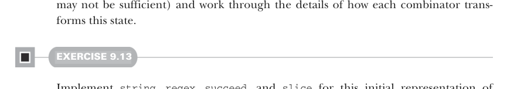
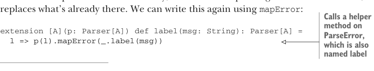

# Page 0265

[<- Page 0264](./page-0264) | [Pages index](./) | [Page 0266 ->](./page-0266)

> Part 2: Functional design and combinator libraries / Chapter 9: Parser combinators / 9.6 Implementing the algebra / 9.6.3 Labeling parsers



may not be sufficient) and work through the details of how each combinator transforms this state.

#### EXERCISE 9.13

Implement `string`, `regex`, `succeed`, and `slice` for this initial representation of `Parser`. Note that `slice` is less efficient than it could be, since it must still construct a value only to discard it. We’ll return to this later.

### 9.6.3 Labeling parsers

Moving down our list of primitives, let’s look at `scope` next. In the event of failure, we want to push a new message onto the `ParseError` stack. Let’s introduce a helper function for this on `ParseError`; we’ll call it `push`:18

```scala
case class ParseError(stack: List[(Location, String)] = Nil):
def push(loc: Location, msg: String): ParseError =
copy(stack = (loc, msg) :: stack)
```


With this we can implement `scope`:

> In the event of failure, push msg onto the error stack.

```scala
extension [A](p: Parser[A]) def scope(msg: String): Parser[A] =
l => p(l).mapError(_.push(l, msg))
```

The function `mapError` is defined on `Result`—it just applies a function to the failing case:

```scala
def mapError(f: ParseError => ParseError): Result[A] = this match
case Failure(e) => Failure(f(e))
case _ => this
```

Because we push onto the stack after the inner parser has returned, the bottom of the stack will have more detailed messages that occurred later in parsing. For example, if `(a` `**` `b.scope(msg2)).scope(msg1)` fails while parsing `b`, then the first error on the stack will be `msg1`, followed by whatever errors were generated by `a`, then `msg2`, and, finally, errors generated by `b`. We can implement `label` similarly, but instead of pushing onto the error stack, it replaces what’s already there. We can write this again using `mapError`:



> Calls a helper method on ParseError, which is also named label

```scala
extension [A](p: Parser[A]) def label(msg: String): Parser[A] =
l => p(l).mapError(_.label(msg))
```

18 The `copy` method comes for free with any `case class`. It returns a copy of the object but with one or more attributes modified. If no new value is specified for a field, it will have the same value as in the original object. Behind the scenes, this uses the ordinary mechanism for default arguments in Scala.

[<- Page 0264](./page-0264) | [Pages index](./) | [Page 0266 ->](./page-0266)
