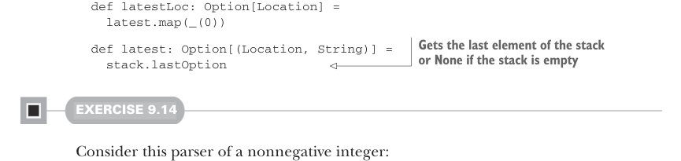

# Page 0266

[<- Page 0265](./page-0265) | [Pages index](./) | [Page 0267 ->](./page-0267)

> Part 2: Functional design and combinator libraries / Chapter 9: Parser combinators / 9.6 Implementing the algebra / 9.6.4 Failover and backtracking

## 237 9.6 Implementing the algebra

We added a helper function to `ParseError`, also named `label`. We’ll make a design decision that `label` trims the error stack, cutting off more detailed messages from inner scopes, using only the most recent location from the bottom of the stack:

```scala
case class ParseError(stack: List[(Location, String)] = Nil):
def label(s: String): ParseError =
ParseError(latestLoc.map((_, s)).toList)
```



```scala
def latestLoc: Option[Location] =
latest.map(_(0))
```

> Gets the last element of the stack or None if the stack is empty

```scala
def latest: Option[(Location, String)] =
stack.lastOption
```

#### EXERCISE 9.14

Consider this parser of a nonnegative integer:

```scala
val nonNegativeInt: Parser[Int] =
for
nString <- regex("[0-9]+".r)
n <- nString.toIntOption match
case Some(n) => succeed(n)
case None => fail("expected an integer")
yield n
```

Revise this implementation to use `scope` or `label` to provide a more meaningful error message in the event of an error.

### 9.6.4 Failover and backtracking Let’s now consider or and attempt. Recall what we specified for the expected behavior of or: it should run the first parser, and if that fails in an uncommitted state, then it should run the second parser on the same input. We said consuming at least one character should result in a committed parse, and that p.attempt converts committed failures of p to uncommitted failures. We can support the behavior we want by adding one more piece of information to the Failure case of Result—a Boolean value indicating whether the parser failed in a committed state:

```scala
case Failure(get: ParseError, isCommitted: Boolean)
```

The implementation of `attempt` just cancels the commitment of any failures that occur. It uses a helper function, `uncommit`, which we can define on `Result`:

```scala
extension [A](p: Parser[A]) def attempt: Parser[A] =
l => p(l).uncommit
enum Result[+A]:
```

[<- Page 0265](./page-0265) | [Pages index](./) | [Page 0267 ->](./page-0267)
