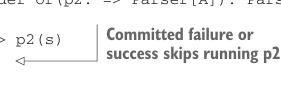
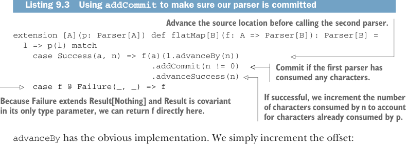

# Page 0267

[<- Page 0266](./page-0266) | [Pages index](./) | [Page 0268 ->](./page-0268)

> Part 2: Functional design and combinator libraries / Chapter 9: Parser combinators / 9.6 Implementing the algebra / 9.6.5 Context-sensitive parsing

```scala
...
def uncommit: Result[A] = this match
case Failure(e, true) => Failure(e, false)
case _ => this
```

Now the implementation of `or` can simply check the `isCommitted` flag before running the second parser. In the parser `p` `or` `p2` if `p` succeeds, then the whole thing succeeds. If `p` fails in a committed state, we fail early and skip running `p2`. Otherwise, if `p` fails in an uncommitted state, then we run `p2` and ignore the result of `p`:

```scala
extension [A](p: Parser[A]) def or(p2: => Parser[A]): Parser[A] =
l => p(l) match
case Failure(e, false) => p2(s)
case r => r
```



> Committed failure or success skips running p2

### 9.6.5 Context-sensitive parsing

Now for the final primitive in our list: `flatMap`. Recall that `flatMap` enables contextsensitive parsers by allowing the selection of a second parser to depend on the result of the first parser. The implementation is simple: we advance the location before calling the second parser. Again, we use a helper function, `advanceBy`, on `Location`. There is one subtlety—if the first parser consumes any characters, we ensure the second parser is committed, using a helper function, `addCommit`, on `ParseError`.



Listing 9.3 Using `addCommit` to make sure our parser is committed

> Advance the source location before calling the second parser.

```scala
extension [A](p: Parser[A]) def flatMap[B](f: A => Parser[B]): Parser[B] =
l => p(l) match
case Success(a, n) => f(a)(l.advanceBy(n))
.addCommit(n != 0)
.advanceSuccess(n)
case f @ Failure(_, _) => f
```

> Commit if the first parser has consumed any characters.

> If successful, we increment the number of characters consumed by n to account for characters already consumed by p.

> Because Failure extends Result[Nothing] and Result is covariant in its only type parameter, we can return f directly here.

`advanceBy` has the obvious implementation. We simply increment the offset:

```scala
def advanceBy(n: Int): Location =
copy(offset = offset + n)
```

Likewise, `addCommit`, defined on `ParseError`, is straightforward:

```scala
def addCommit(isCommitted: Boolean): Result[A] = this match
case Failure(e, c) => Failure(e, c || isCommitted)
case _ => this
```

And finally, `advanceSuccess` increments the number of consumed characters of a successful result. We want the total number of characters consumed by `flatMap` to be the

[<- Page 0266](./page-0266) | [Pages index](./) | [Page 0268 ->](./page-0268)
