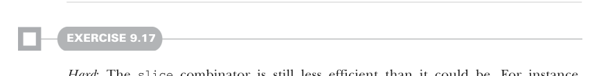

# Page 0268

[<- Page 0267](./page-0267) | [Pages index](./) | [Page 0269 ->](./page-0269)

> Part 2: Functional design and combinator libraries / Chapter 9: Parser combinators / 9.6 Implementing the algebra / 9.6.5 Context-sensitive parsing

## 239 9.6 Implementing the algebra


sum of the consumed characters of the parser `p` and the parser produced by `f`. We use `advanceSuccess` on the result of `f` to ensure this:

```scala
def advanceSuccess(n: Int): Result[A] = this match
case Success(a, m) => Success(a, n + m)
case _ => this
```

> If unsuccessful, leave the result alone.

#### EXERCISE 9.15

Implement the rest of the primitives, including `run`, using this representation of `Parser`, and try running your JSON parser on various inputs. You’ll find, unfortunately, that this representation causes stack overflow for large inputs (e.g., `[1,2,3,...10000]`). One simple solution to this is providing a specialized implementation of `many` that avoids using a stack frame for each element of the list being built up. So long as any combinators that do repetition are defined in terms of `many` (which they all can be), this solves the problem.


#### EXERCISE 9.16

Come up with a nice way of formatting a `ParseError` for human consumption. There are many choices to make, but a key insight is that we typically want to combine or group labels attached to the same location when presenting the error as a `String` for display.



#### EXERCISE 9.17

*Hard*: The `slice` combinator is still less efficient than it could be. For instance, `char('a').many.slice` will still build up a `List[Char]`, only to discard it. Can you think of a way of modifying the `Parser` representation to make slicing more efficient?


#### EXERCISE 9.18

Some information is lost when we combine parsers with the `or` combinator. If both parsers fail, we’re only keeping the errors from the second parser. But we might want to show both error messages or choose the error from whichever branch got furthest without failing. Change the representation of `ParseError` to keep track of errors that occurred in other branches of the parser.

[<- Page 0267](./page-0267) | [Pages index](./) | [Page 0269 ->](./page-0269)
