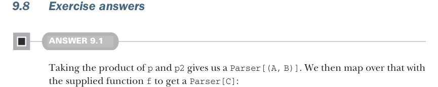

# Page 0270

[<- Page 0269](./page-0269) | [Pages index](./) | [Page 0271 ->](./page-0271)

> Part 2: Functional design and combinator libraries / Chapter 9: Parser combinators / 9.8 Exercise answers

## 241 9.8 Exercise answers



### 9.8 Exercise answers

#### ANSWER 9.1

Taking the product of `p` and `p2` gives us a `Parser[(A,` `B)]`. We then map over that with the supplied function `f` to get a `Parser[C]`:

```scala
extension [A](p: Parser[A])
def map2[B, C](p2: Parser[B])(f: (A, B) => C): Parser[C] =
p.product(p2).map((a, b) => f(a, b))
```

To implement `many1`, we use `map2` to combine the results of `p` and `p.many` into a single list by consing the result of `p` onto the result of `p.many`:

```scala
extension [A](p: Parser[A])
def many1: Parser[List[A]] =
p.map2(p.many)(_ :: _)
```


#### ANSWER 9.2

The `product` operation is associative. These two expressions are roughly equal:

```scala
(a ** b) ** c
a ** (b ** c)
```

The only difference is how the pairs are nested. The `(a` `**` `b)` `**` `c` parser returns an `((A,` `B),` `C)`, whereas the `a` `**` `(b` `**` `c)` returns an `(A,` `(B,` `C))`. We can define the functions `unbiasL` and `unbiasR` to convert these nested tuples to flat 3-tuples:

```scala
def unbiasL[A, B, C](p: ((A, B), C)): (A, B, C) = (p(0)(0), p(0)(1), p(1))
def unbiasR[A, B, C](p: (A, (B, C))): (A, B, C) = (p(0), p(1)(0), p(1)(1))
```

With these, we can now state the associativity property:

```scala
((a ** b) ** c).map(unbiasL) == (a ** (b ** c)).map(unbiasR)
```

We’ll sometimes just use `~=` when there is an obvious bijection between the two sides:

```scala
(a ** b) ** c ~= a ** (b ** c)
```

`map` and `product` also have an interesting relationship; we can `map` either before or after taking the product of two parsers, without affecting the behavior:

```scala
a.map(f) ** b.map(g) == (a ** b).map((a,b) => (f(a), g(b)))
```

[<- Page 0269](./page-0269) | [Pages index](./) | [Page 0271 ->](./page-0271)
