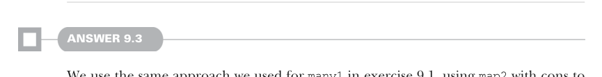

# Page 0271

[<- Page 0270](./page-0270) | [Pages index](./) | [Page 0272 ->](./page-0272)

> Part 2: Functional design and combinator libraries / Chapter 9: Parser combinators / 9.8 Exercise answers

For instance, if `a` and `b` were both `Parser[String]` and `f` and `g` both computed the length of a string, then it wouldn’t matter if we mapped over the result of `a` to compute its length or whether we did that after the product. See chapter 12 for more discussion of these laws.



#### ANSWER 9.3

We use the same approach we used for `many1` in exercise 9.1, using `map2` with cons to build a list. When that fails, due to exhausting the input or otherwise, we succeed with an empty list:

```scala
extension [A](p: Parser[A])
def many: Parser[List[A]] =
p.map2(p.many)(_ :: _) | succeed(Nil)
```

This implementation has a problem, though: we recursively call `p.many`, and our `map2` implementation takes its argument strictly, resulting in a stack overflow. To correct this, we need to change `map2` to take the parser argument nonstrictly. We’ll look at this in greater depth in the next section of the chapter.


#### ANSWER 9.4

`listOfN` is very similar to `many`—the only difference being the limit on the number of elements to parse. Hence, we can implement it via a similar technique of a `map2` with a recursive call to `listOfN(n` `-` `1)` on each iteration. When `n` reaches zero, we succeed with the empty list:

```scala
extension [A](p: Parser[A])
def listOfN(n: Int): Parser[List[A]] =
if n <= 0 then succeed(Nil)
else p.map2(p.listOfN(n - 1))(_ :: _)
```


#### ANSWER 9.5

We need a way to defer creation of a parser. We can do this via a new constructor that takes a by-name parser argument and delays evaluation of that argument until it attempts to parse something:

```scala
def defer[A](p: => Parser[A]): Parser[A]
```

[<- Page 0270](./page-0270) | [Pages index](./) | [Page 0272 ->](./page-0272)
