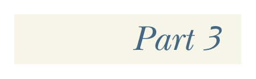

# Page 0282

[<- Page 0281](./page-0281) | [Pages index](./) | [Page 0283 ->](./page-0283)

> Part 3: Common structures in functional design

*Part 3*

## Common structures in functional design

## W e’ve now written a number of libraries using the principles of functional design. In part 2, we saw these principles applied to a few concrete problem domains. By now you should have a good grasp of how to approach a programming problem in your own work, while striving for compositionality and algebraic reasoning. Part 3 takes a much wider perspective. We’ll look at the common patterns that arise in functional programming. In part 2, we experimented with various libraries that provided concrete solutions to real-world problems, and now we want to integrate what we’ve learned from our experiments into abstract theories that describe the common structure among those libraries. This kind of abstraction has a direct practical benefit: it eliminates duplicate code. We can capture abstractions as classes, interfaces, and functions that we can refer to in our actual programs. Its primary benefit, however, is conceptual integration. When we recognize common structure among different solutions in different contexts, we unite all of those instances of the structure under a single definition and give it a name. As you gain experience with this, you can look at the general shape of a problem and say, for example, “That looks like a monad!” You’re then already far along in finding the shape of the solution. A secondary benefit is that if other people have developed the same kind of vocabulary, you can communicate your designs to them with extraordinary efficiency. Part 3 won’t be a sequence of meandering journeys in the style of part 2. Instead, we’ll begin each chapter by introducing an abstract concept, providing

[<- Page 0281](./page-0281) | [Pages index](./) | [Page 0283 ->](./page-0283)
