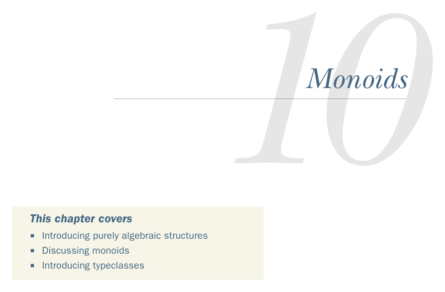

# Page 0284

[<- Page 0283](./page-0283) | [Pages index](./) | [Page 0285 ->](./page-0285)

> Part 3: Common structures in functional design / Chapter 10: Monoids

*Monoids*

### This chapter covers

Introducing purely algebraic structures

Discussing monoids

Introducing typeclasses

By the end of part 2, we were getting comfortable with considering data types in terms of their algebras—that is, the operations they support and the laws that govern those operations. Hopefully, you will have noticed that the algebras of very different data types tend to share certain patterns in common. In this chapter, we’ll begin identifying these patterns and taking advantage of them. This chapter will be our first introduction to *purely algebraic* structures. We’ll consider a simple structure, the *monoid*,1 which is defined only by its algebra. Aside from satisfying the same laws, instances of the monoid interface may have little or nothing to do with one another. Nonetheless, we’ll see how this algebraic structure is often all we need to write useful, polymorphic functions.

1 The name *monoid* comes from mathematics. In abstract algebra, a monoid is an associative binary operation closed on a set with an identity element. In category theory, it means a category with one object. These mathematical connections aren’t important for our purposes, but see the chapter notes (https://github.com/fpinscala/fpinscala/wiki) for more information.

**255**

[<- Page 0283](./page-0283) | [Pages index](./) | [Page 0285 ->](./page-0285)
