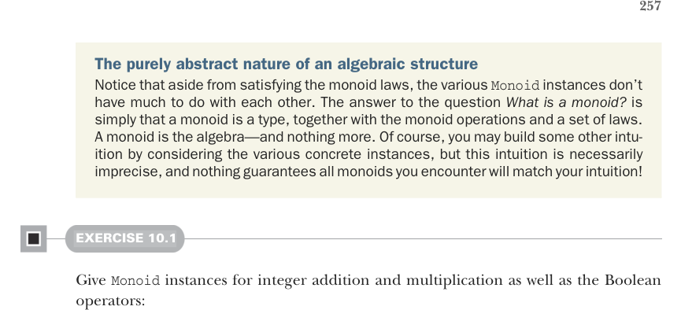
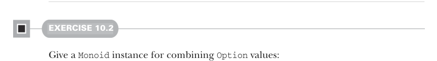
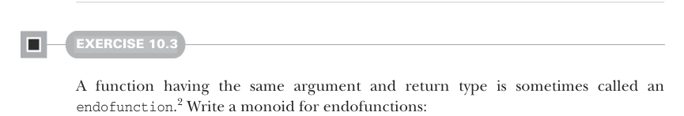
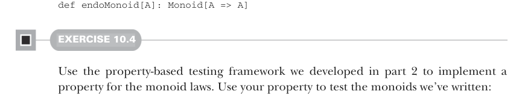

# Page 0286

[<- Page 0285](./page-0285) | [Pages index](./) | [Page 0287 ->](./page-0287)

> Part 3: Common structures in functional design / Chapter 10: Monoids / 10.1 What is a monoid?



The purely abstract nature of an algebraic structure Notice that aside from satisfying the monoid laws, the various `Monoid` instances don’t have much to do with each other. The answer to the question *What is a monoid?* is simply that a monoid is a type, together with the monoid operations and a set of laws. A monoid is the algebra—and nothing more. Of course, you may build some other intuition by considering the various concrete instances, but this intuition is necessarily imprecise, and nothing guarantees all monoids you encounter will match your intuition!

#### EXERCISE 10.1

Give `Monoid` instances for integer addition and multiplication as well as the Boolean operators:

```scala
val intAddition: Monoid[Int]
val intMultiplication: Monoid[Int]
val booleanOr: Monoid[Boolean]
val booleanAnd: Monoid[Boolean]
```



#### EXERCISE 10.2

Give a `Monoid` instance for combining `Option` values:

```scala
def optionMonoid[A]: Monoid[Option[A]]
```



#### EXERCISE 10.3

A function having the same argument and return type is sometimes called an `endofunction`.2 Write a monoid for endofunctions:



```scala
def endoMonoid[A]: Monoid[A => A]
```

#### EXERCISE 10.4

Use the property-based testing framework we developed in part 2 to implement a property for the monoid laws. Use your property to test the monoids we’ve written:

```scala
def monoidLaws[A](m: Monoid[A], gen: Gen[A]): Prop
```

2 The Greek prefix *endo**-* means *within*, in the sense that an endofunction’s codomain is within its domain.

[<- Page 0285](./page-0285) | [Pages index](./) | [Page 0287 ->](./page-0287)
