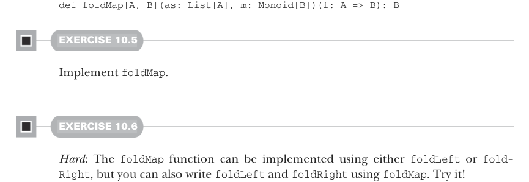

# Page 0288

[<- Page 0287](./page-0287) | [Pages index](./) | [Page 0289 ->](./page-0289)

> Part 3: Common structures in functional design / Chapter 10: Monoids / 10.3 Associativity and parallelism

## 259 10.3 Associativity and parallelism

Note that it doesn’t matter if we choose `foldLeft` or `foldRight` when folding with a monoid;3 we should get the same result. This is precisely because the laws of associativity and identity hold. A left fold associates operations to the left, whereas a right fold associates to the right, with the identity element on the left and right, respectively:

```scala
words.foldLeft("")(_ + _)
== (("" + "Hic") + "Est") + "Index"
words.foldRight("")(_ + _) == "Hic" + ("Est" + ("Index" + ""))
```

We can write a general function `combineAll` that folds a list with a monoid:

```scala
def combineAll[A](as: List[A], m: Monoid[A]): A =
as.foldLeft(m.empty)(m.combine)
```

But what if our list has an element type that doesn’t have a `Monoid` instance? Well, we can always `map` over the list to turn it into a type that does:



```scala
def foldMap[A, B](as: List[A], m: Monoid[B])(f: A => B): B
```

#### EXERCISE 10.5

Implement `foldMap`.

#### EXERCISE 10.6

*Hard*: The `foldMap` function can be implemented using either `foldLeft` or `fold-` `Right`, but you can also write `foldLeft` and `foldRight` using `foldMap`. Try it!

### 10.3 Associativity and parallelism

The fact that a monoid’s operation is associative means we can choose how we fold a data structure like a list. We’ve already seen that operations can be associated to the left or right to reduce a list sequentially with `foldLeft` or `foldRight`. But if we have a monoid, we can reduce a list using a *balanced fold*, which can be more efficient for some operations as well as allow for parallelism. As an example, suppose we have a sequence `a,` `b,` `c,` `d` that we’d like to reduce using some monoid. Folding to the right, the combination of `a`, `b`, `c`, and `d` would look like this:


```scala
combine(a, combine(b, combine(c, d)))
```

3 Given that both `foldLeft` and `foldRight` have tail-recursive implementations.

[<- Page 0287](./page-0287) | [Pages index](./) | [Page 0289 ->](./page-0289)
