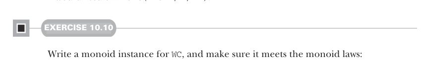
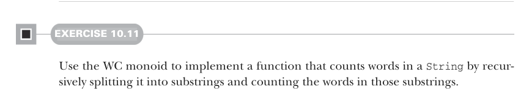

# Page 0291

[<- Page 0290](./page-0290) | [Pages index](./) | [Page 0292 ->](./page-0292)

> Part 3: Common structures in functional design / Chapter 10: Monoids / 10.4 Example: Parallel parsing

need to find a data structure that can handle partial results like the half-words `do` and `lor` and track the complete words seen so far, like `ipsum`, `sit`, and `amet`. The partial result of the word count could be represented by an algebraic data type:

```scala
enum WC:
case Stub(chars: String)
case Part(lStub: String, words: Int, rStub: String)
```

A `Stub` is the simplest case, where we haven’t seen any complete words yet. But a `Part` keeps the number of complete words we’ve seen so far in `words`. The value `lStub` holds any partial word we’ve seen to the left of those words, and `rStub` holds any partial word on the right. For example, counting over the string `"lorem` `ipsum` `do"` would result in `Part("lorem",` `1,` `"do")`, since there’s one word that’s certainly complete: `"ipsum"`. And since there’s no whitespace to the left of `lorem` or the right of `do`, we can’t be sure if they’re complete words, so we don’t count them yet. Counting over `"lor` `sit` `amet,` `"` would result in `Part("lor",` `2,` `"")`.



#### EXERCISE 10.10

Write a monoid instance for `WC`, and make sure it meets the monoid laws:

```scala
val wcMonoid: Monoid[WC]
```



#### EXERCISE 10.11

Use the WC monoid to implement a function that counts words in a `String` by recursively splitting it into substrings and counting the words in those substrings.


Monoid homomorphisms If you have your law-discovering cap on while reading this chapter, you may notice there’s a law that holds for some functions between monoids. Take the `String` concatenation monoid and the integer addition monoid. If you take the lengths of two strings and add them up, it’s the same as taking the length of the concatenation of those two strings:

```scala
"foo".length + "bar".length == ("foo" + "bar").length
```

[<- Page 0290](./page-0290) | [Pages index](./) | [Page 0292 ->](./page-0292)
