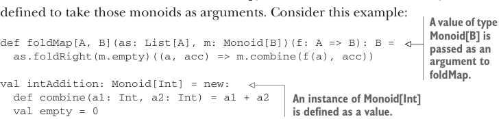

# Page 0292

[<- Page 0291](./page-0291) | [Pages index](./) | [Page 0293 ->](./page-0293)

> Part 3: Common structures in functional design / Chapter 10: Monoids / 10.5 Typeclasses


## 263 10.5 Typeclasses

Here `length` is a function from `String` to `Int` that preserves the monoid structure. Such a function is called a *monoid homomorphism*.6 A monoid homomorphism `f` between monoids `M` and `N` obeys the following general law for all values `x` and `y`:

```scala
M.combine(f(x), f(y)) == f(N.combine(x, y))
```

The same law should hold for the homomorphism from `String` to `WC` in the present exercise.

This property can be useful when designing your own libraries. If two types that your library uses are monoids and there exist functions between them, it’s a good idea to think about whether those functions are expected to preserve the monoid structure and check the monoid homomorphism law with automated tests.

Sometimes there will be a homomorphism in both directions between two monoids. If they satisfy a *monoid isomorphism* (with *iso**-* meaning *equal*), we say the two monoids are isomorphic. A monoid isomorphism between `M` and `N` has two homomorphisms, `f` and `g`, where both `f` `andThen` `g` and `g` `andThen` `f` are an identity function.

For example, the `String` and `List[Char]` monoids with concatenation are isomorphic. The Boolean monoids `(false,` `||)` and `(true,` `&&)` are also isomorphic via the `!` (negation) function.

### 10.5 Typeclasses6

The various monoids we’ve looked at so far have all been defined as simple values and functions. Generic functions like `foldMap`, which made use of monoids, have been defined to take those monoids as arguments. Consider this example:



> A value of type Monoid[B] is passed as an argument to foldMap.

```scala
def foldMap[A, B](as: List[A], m: Monoid[B])(f: A => B): B =
as.foldRight(m.empty)((a, acc) => m.combine(f(a), acc))
```


```scala
val intAddition: Monoid[Int] = new:
def combine(a1: Int, a2: Int) = a1 + a2
val empty = 0
```


> An instance of Monoid[Int] is defined as a value.

```scala
val strings = List("abra", "ca", "dabra")
```

> When we use foldMap, we pass the monoid to use.

```scala
val charCount = foldMap(strings, intAddition)(_.length)
```

Instead of passing monoid values, we can have Scala pass them automatically by slightly altering the definition of `foldMap`:

```scala
def foldMap[A, B](as: List[A])(f: A => B)(using m: Monoid[B]): B =
as.foldRight(m.empty)((a, acc) => m.combine(f(a), acc))
```

6* Homomorphism* comes from the Greek *homo*, meaning *same*, and *morphe*, meaning *shape*.

[<- Page 0291](./page-0291) | [Pages index](./) | [Page 0293 ->](./page-0293)
