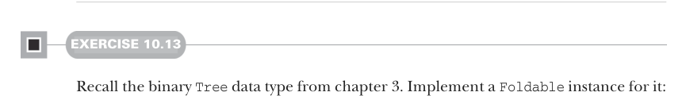

# Page 0295

[<- Page 0294](./page-0294) | [Pages index](./) | [Page 0296 ->](./page-0296)

> Part 3: Common structures in functional design / Chapter 10: Monoids / 10.6 Foldable data structures

forth. For example, if we have a structure full of integers and want to calculate their sum, we can use `foldRight`:

```scala
ints.foldRight(0)(_ + _)
```

Looking at just this code snippet, we shouldn’t have to care about the type of `ints`. It could be a `Vector`, `Stream`, `List`, or anything at all with a `foldRight` method. We can capture this commonality in a typeclass:

```scala
trait Foldable[F[_]]:
extension [A](as: F[A])
def foldRight[B](acc: B)(f: (A, B) => B): B
def foldLeft[B](acc: B)(f: (B, A) => B): B
def foldMap[B](f: A => B)(using m: Monoid[B]): B
def combineAll(using m: Monoid[A]): A =
as.foldLeft(m.empty)(m.combine)
```

Here we’re abstracting over a type constructor `F`, much like we did with the `Parser` type in the previous chapter. We write it as `F[_]`, where the underscore indicates `F` is not a proper type but a type constructor that takes one type argument. Just like functions that take other functions as arguments are called *higher-order functions*, something like `Foldable` is a *higher-order type constructor* or a *higher-kinded type*.9


#### EXERCISE 10.12

Implement `Foldable[List]`, `Foldable[IndexedSeq]`, and `Foldable[LazyList]`. Remember that `foldRight`, `foldLeft`, and `foldMap` can all be implemented in terms of each other, but that might not be the most efficient implementation.



#### EXERCISE 10.13

Recall the binary `Tree` data type from chapter 3. Implement a `Foldable` instance for it:

```scala
enum Tree[+A]:
case Leaf[A](value: A)
case Branch[A](left: Tree[A], right: Tree[A])
```

9 Just like values and functions have types, types and type constructors have *kinds*. Scala uses kinds to track how many type arguments a type constructor takes, whether it’s co- or contravariant in those arguments, and what kinds of arguments those are.

[<- Page 0294](./page-0294) | [Pages index](./) | [Page 0296 ->](./page-0296)
