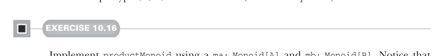

# Page 0296

[<- Page 0295](./page-0295) | [Pages index](./) | [Page 0297 ->](./page-0297)

> Part 3: Common structures in functional design / Chapter 10: Monoids / 10.7 Composing monoids / 10.7.1 Assembling more complex monoids

## 267 10.7 Composing monoids


#### EXERCISE 10.14

Write a `Foldable[Option]` instance.

#### EXERCISE 10.15

Any `Foldable` structure can be turned into a `List`. Add a `toList` extension method to the `Foldable` trait, and provide a concrete implementation in terms of the other methods on `Foldable`:

```scala
trait Foldable[F[_]]:
extension [A](as: F[A])
def toList: List[A] = ???
```

### 10.7 Composing monoids

The `Monoid` abstraction in itself is not all that compelling, and with the generalized `foldMap`, it’s only slightly more interesting. The real power of monoids comes from the fact that they *compose*. This means, for example, that if types `A` and `B` are monoids, then the tuple type `(A,` `B)` is also a monoid (called their *product*).



#### EXERCISE 10.16

Implement `productMonoid` using a `ma:` `Monoid[A]` and `mb:` `Monoid[B]`. Notice that your implementation of `combine` is associative so long as `ma.combine` and `mb.combine` are both associative:

```scala
given productMonoid[A, B](
using ma: Monoid[A], mb: Monoid[B]
): Monoid[(A, B)] with
def combine(x: (A, B), y: (A, B)) = ???
val empty = ???
```

### 10.7.1 Assembling more complex monoids

Some data structures form interesting monoids as long as the types of elements they contain also form monoids. For instance, there’s a monoid for merging key-value `Map`s, as long as the value type is a monoid.

[<- Page 0295](./page-0295) | [Pages index](./) | [Page 0297 ->](./page-0297)
