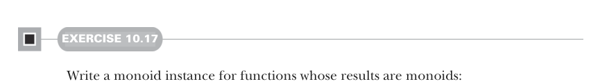
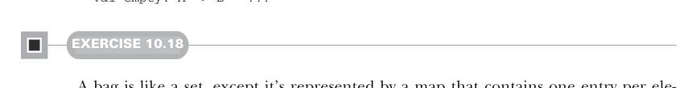

# Page 0298

[<- Page 0297](./page-0297) | [Pages index](./) | [Page 0299 ->](./page-0299)

> Part 3: Common structures in functional design / Chapter 10: Monoids / 10.8 Conclusion

## 269 10.8 Conclusion



#### EXERCISE 10.17

Write a monoid instance for functions whose results are monoids:

```scala
given functionMonoid[A, B](using mb: Monoid[B]): Monoid[A => B] with
def combine(f: A => B, g: A => B): A => B = ???
val empty: A => B = ???
```



#### EXERCISE 10.18

A bag is like a set, except it’s represented by a map that contains one entry per element, with that element as the key and the value under that key as the number of times the element appears in the bag. For example:

```scala
scala> bag(Vector("a", "rose", "is", "a", "rose"))
res0: Map[String,Int] = Map(a -> 2, rose -> 2, is -> 1)
```

Use monoids to compute a bag from an `IndexedSeq`:

```scala
def bag[A](as: IndexedSeq[A]): Map[A, Int]
```

### 10.7.2 Using composed monoids to fuse traversals

The fact that multiple monoids can be composed into one means we can perform multiple calculations simultaneously when folding a data structure. For example, we can take the length and sum of a list at the same time to calculate the mean:


```scala
scala> import Foldable.given
```

> This imports the foldMap extension method. If we forget this import, the compiler helpfully suggests it.

```scala
scala> val p = List(1, 2, 3, 4).foldMap(a => (1, a))
p: (Int, Int) = (4, 10)
scala> val mean = p(1) / p(0).toDouble
mean: Double = 2.5
```

We’re folding with a product monoid with two additive int monoids. This instance would be tedious to assemble by hand, but Scala derives it for us, thanks to our given instances (in this case, `productMonoid` and `intAddition` defined in the `Monoid` companion).

### 10.8 Conclusion

Our goal in part 3 is to get you accustomed to working with more abstract structures and develop the ability to recognize them. In this chapter, we introduced one of the simplest purely algebraic abstractions: the monoid. When you start looking for it, you’ll find ample opportunity to exploit the monoidal structure of your own libraries.

[<- Page 0297](./page-0297) | [Pages index](./) | [Page 0299 ->](./page-0299)
