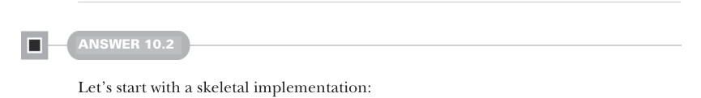

# Page 0300

[<- Page 0299](./page-0299) | [Pages index](./) | [Page 0301 ->](./page-0301)

> Part 3: Common structures in functional design / Chapter 10: Monoids / 10.9 Exercise answers

## 271 10.9 Exercise answers

The `Foldable` typeclass describes type constructors that support computing an output value by folding over their elements—that is, support `foldLeft`, `fold-` `Right`, `foldMap`, and `combineAll`.


### 10.9 Exercise answers

#### ANSWER 10.1

```scala
val intAddition: Monoid[Int] = new:
def combine(x: Int, y: Int) = x + y
val empty = 0
val intMultiplication: Monoid[Int] = new:
def combine(x: Int, y: Int) = x * y
val empty = 1
val booleanOr: Monoid[Boolean] = new:
def combine(x: Boolean, y: Boolean) = x || y
val empty = false
val booleanAnd: Monoid[Boolean] = new:
def combine(x: Boolean, y: Boolean) = x && y
val empty = true
```



#### ANSWER 10.2

Let’s start with a skeletal implementation:

```scala
def optionMonoid[A]: Monoid[Option[A]] = new:
def combine(x: Option[A], y: Option[A]) = ???
val empty = ???
```

This type signature constrains our implementation quite a bit. Consider the information we don’t have here:

We have no way of constructing a value of type `A`.

We have no way of modifying a value of type `A`.

We have no way of combining multiple values of type `A` into a new value.

With these constraints in mind, let’s implement `empty` and `combine`. To implement `empty`, we need to return an `Option[A]`, which acts as an identity for our `combine` operation. We could either return a `None` or a `Some`, but since we have no way of constructing a value of type `A` to wrap in `Some`, we’re forced to return `None`. What possibilities do we have for implementing `combine`? There are three cases to consider: when both inputs are `None`, when both inputs are `Some`, and when one input is `None` while the other is `Some`:

[<- Page 0299](./page-0299) | [Pages index](./) | [Page 0301 ->](./page-0301)
