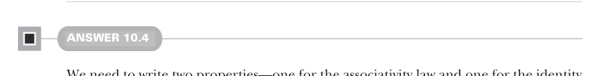

# Page 0302

[<- Page 0301](./page-0301) | [Pages index](./) | [Page 0303 ->](./page-0303)

> Part 3: Common structures in functional design / Chapter 10: Monoids / 10.9 Exercise answers

## 273 10.9 Exercise answers


that combines two `Some` values if we had a way of combining two `A` values. Let’s ask for that:

> This assumes we have a map2 extension method on Option, since the standard library does not define map2.

```scala
def optionMonoid[A](f: (A, A) => A): Monoid[Option[A]] = new:
def combine(x: Option[A], y: Option[A]) = x.map2(y)(f)
val empty = None
```

#### ANSWER 10.3

Let’s start with a skeletal implementation:

```scala
def endoMonoid[A]: Monoid[A => A] = new:
def combine(f: A => A, g: A => A): A => A = ???
val empty: A => A = ???
```

For `empty` we need to return a function from `A` to `A`—given what we know (or rather what we don’t know), the only possible implementation is returning the identity function. For `combine` we have two functions from `A` to `A`, and we can compose them in one of two ways—either first `f` and then `g`, or vice versa. Whichever we choose can be combined with `dual` from exercise 10.2 to generate the other:

```scala
def endoMonoid[A]: Monoid[A => A] = new:
def combine(f: A => A, g: A => A): A => A = f andThen g
val empty: A => A = identity
```



#### ANSWER 10.4

We need to write two properties—one for the associativity law and one for the identity law. For the associativity property, we need to generate three values and assert that combining them all is associative. We can use the `**` operation on `Gen` to do this. The identity property can be tested by generating a single value and ensuring the following:

Combining it with the empty value results in the generated value

Combining the empty value with the generated value results in the generated value

```scala
import fpinscala.testing.{Prop, Gen}
import Gen.`**`
def monoidLaws[A](m: Monoid[A], gen: Gen[A]): Prop =
val associativity = Prop
.forAll(gen ** gen ** gen):
case a ** b ** c =>
```

[<- Page 0301](./page-0301) | [Pages index](./) | [Page 0303 ->](./page-0303)
