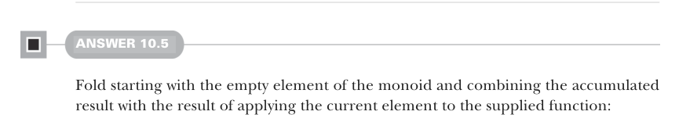
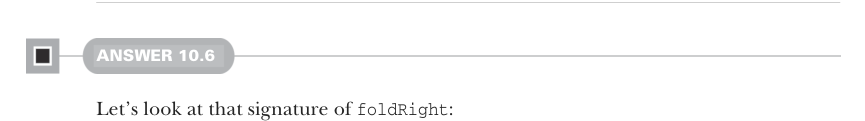

# Page 0303

[<- Page 0302](./page-0302) | [Pages index](./) | [Page 0304 ->](./page-0304)

> Part 3: Common structures in functional design / Chapter 10: Monoids / 10.9 Exercise answers

```scala
m.combine(a, m.combine(b, c)) == m.combine(m.combine(a, b), c)
.tag("associativity")
val identity = Prop
.forAll(gen): a =>
m.combine(a, m.empty) == a && m.combine(m.empty, a) == a
.tag("identity")
associativity && identity
```

Note that we tagged each law with a name, so the cause of failure is more evident.



#### ANSWER 10.5

Fold starting with the empty element of the monoid and combining the accumulated result with the result of applying the current element to the supplied function:

```scala
def foldMap[A, B](as: List[A], m: Monoid[B])(f: A => B): B =
as.foldLeft(m.empty)((b, a) => m.combine(b, f(a)))
```



#### ANSWER 10.6

Let’s look at that signature of `foldRight`:

```scala
def foldRight[A, B](as: List[A])(acc: B)(f: (A, B) => B): B = ???
```

The key insight is that we can curry `f`, converting it from `(A,` `B)` `=>` `B` to `A` `=>` `(B` `=>` `B)`. We can then `foldMap` the elements of the list using that curried function and the `endo-` `Monoid` from earlier. The result of that is a single function of type `B` `=>` `B`, which we can then invoke using the initial `acc` value:

```scala
def foldRight[A, B](as: List[A])(acc: B)(f: (A, B) => B): B =
foldMap(as, endoMonoid)(f.curried)(acc)
```

This implementation compiles but gives incorrect results. Consider this example:

```scala
scala> Monoid.foldRight(List("a", "b", "c"))("")(_ + _)
val res0: String = cba
```

The problem is that our function composition is occurring in the wrong order. We can fix that by flipping the parameters to the `endoMonoid` by using its dual:

```scala
def foldRight[A, B](as: List[A])(acc: B)(f: (A, B) => B): B =
foldMap(as, dual(endoMonoid))(f.curried)(acc)
```

[<- Page 0302](./page-0302) | [Pages index](./) | [Page 0304 ->](./page-0304)
