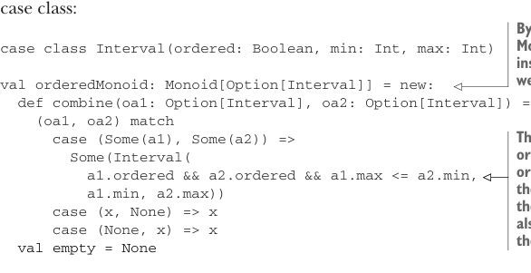

# Page 0305

[<- Page 0304](./page-0304) | [Pages index](./) | [Page 0306 ->](./page-0306)

> Part 3: Common structures in functional design / Chapter 10: Monoids / 10.9 Exercise answers


#### ANSWER 10.9

One way of approaching this problem is by treating it as a map-reduce problem. Imagine splitting the sequence in half, determining if each half is ordered, and then combining those results into a final answer. How would we combine the result of checking each half? The overall sequence is ordered if both halves are ordered and the maximum value in the left half is less than or equal to the minimum value in the right half. Hence, we’re going to need a monoid that tracks whether a sequence is ordered and tracks the minimum and maximum values in that interval. Let’s do that with a new case class:



> By defining Monoid[Option[Interval]] instead of Monoid[Interval], we can define empty as None.

```scala
case class Interval(ordered: Boolean, min: Int, max: Int)
val orderedMonoid: Monoid[Option[Interval]] = new:
def combine(oa1: Option[Interval], oa2: Option[Interval]) =
(oa1, oa2) match
case (Some(a1), Some(a2)) =>
Some(Interval(
a1.ordered && a2.ordered && a1.max <= a2.min,
a1.min, a2.max))
case (x, None) => x
case (None, x) => x
val empty = None
```

> The merged sequence is ordered when both inputs are ordered and the max value on the left is less than or equal to the min value on the right. We also compute a new max for the overall sequence.

Then we can use this monoid with either `foldMap`, `foldMapV`, or `parFoldMap`—all will return the same result but do so with varying levels of efficiency. We’ll need to convert each integer into an `Option[Interval]`, and when `foldMapV` returns, we’ll need to unwrap the option and discard the min/max values:


```scala
def ordered(ints: IndexedSeq[Int]): Boolean =
foldMapV(ints, orderedMonoid)(i =>
Some(Interval(true, i, i)))
.map(_.ordered).getOrElse(true)
```

> A sequence with a single element is ordered and has a max value equal to that element.

#### ANSWER 10.10

We need to implement `empty` and `combine`; let’s consider `empty` first. Since we haven’t seen any characters yet, we can use a `Stub("")` as the empty value:

```scala
val wcMonoid: Monoid[WC] = new:
val empty = WC.Stub("")
```

Now let’s consider `combine`. Since our algebraic data type has two cases, `Stub` and `Part`, we’ll need `combine` to handle four total cases: combining a stub with a stub, a stub with a part, a part with a stub, and a part with a part. Let’s sketch that:

[<- Page 0304](./page-0304) | [Pages index](./) | [Page 0306 ->](./page-0306)
