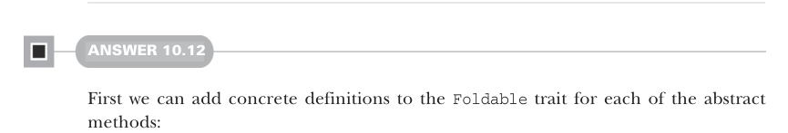

# Page 0308

[<- Page 0307](./page-0307) | [Pages index](./) | [Page 0309 ->](./page-0309)

> Part 3: Common structures in functional design / Chapter 10: Monoids / 10.9 Exercise answers

## 279 10.9 Exercise answers

```scala
foldMapV(s.toIndexedSeq, wcMonoid)(wc) match
case WC.Stub(s) => unstub(s)
case WC.Part(l, w, r) => unstub(l) + w + unstub(r)
```

Here we created an `unstub` function that returns `0` if the input string is empty and `1` otherwise. If the fold finishes in a single stub, we return either `0` or `1`, depending on whether that string is empty. Note that if it’s nonempty, it necessarily does not contain whitespace characters, due to our definition of `wc`. Similarly, if the fold finishes in a part, then we unstub the left and right stubs and add the result to the part’s word count.



#### ANSWER 10.12

First we can add concrete definitions to the `Foldable` trait for each of the abstract methods:

```scala
trait Foldable[F[_]]:
import Monoid.{endoMonoid, dual}
extension [A](as: F[A])
def foldRight[B](acc: B)(f: (A, B) => B): B =
as.foldMap(f.curried)(using dual(endoMonoid[B]))(acc)
def foldLeft[B](acc: B)(f: (B, A) => B): B =
as.foldMap(a => b => f(b, a))(using endoMonoid[B])(acc)
def foldMap[B](f: A => B)(using mb: Monoid[B]): B =
as.foldRight(mb.empty)((a, b) => mb.combine(f(a), b))
def combineAll(using ma: Monoid[A]): A =
as.foldLeft(ma.empty)(ma.combine)
```

Here we’ve implemented `foldLeft` and `foldRight` in terms of `foldMap`, and we’ve implemented `foldMap` in terms of `foldRight`, using the implementations from exercise 10.6. This leaves us with no abstract operations! However, an instance will have to override either `foldRight` or `foldMap`; otherwise, it will result in infinite recursive loops. This technique allows us to choose which operations are fundamental and which are derived in terms of those fundamental operations based on the target type. An alternate design choice would be leaving `foldLeft` and `foldRight` abstract, since we know the implementations of those operations defined in terms of `foldMap` are likely not as performant. The `List` implementation overrides `foldLeft` and `foldRight` and delegates to the built-in methods on `List`:

```scala
given Foldable[List] with
extension [A](as: List[A])
override def foldRight[B](acc: B)(f: (A, B) => B) =
```

[<- Page 0307](./page-0307) | [Pages index](./) | [Page 0309 ->](./page-0309)
